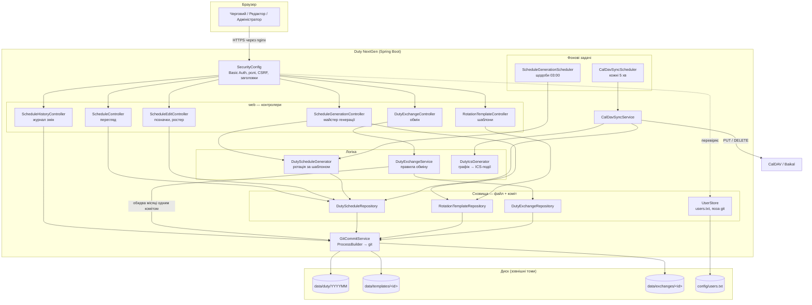
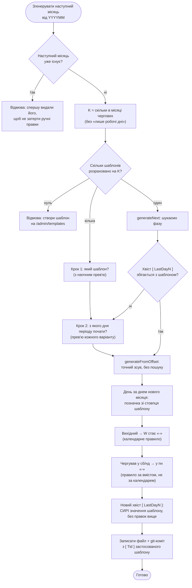
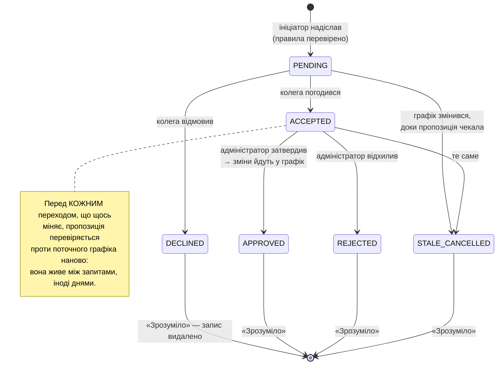

# Duty NextGen

Веб-застосунок для планування чергувань системних адміністраторів:
хто коли чергує, хто у відпустці, хто на лікарняному — з автоматичною
публікацією графіка в календар (CalDAV) і повною історією змін.

Розрахований на невелику команду (типово 2–12 осіб), яка працює
позмінно: чергування розподіляються за повторюваним шаблоном ротації,
графік на наступний місяць застосунок будує сам, а живі відхилення
(відпустка, лікарняний, обмін днями між колегами) вносяться через
браузер і одразу потрапляють у календарі всієї команди.

**Що це вирішує.** Графік чергувань — це документ, який одночасно має
бути: передбачуваним (ротація за правилом, а не «як домовились»),
живим (люди хворіють і міняються днями), доступним (кожен має бачити
свої дні у власному календарі) і підзвітним (хто саме і коли поставив
цю позначку). Duty NextGen тримає всі чотири властивості разом: ротацію
рахує генератор, правки вносяться у вебі, календарі оновлюються фоном,
а кожна зміна лягає окремим git-комітом з іменем автора.

**Чого тут навмисно нема.** Бази даних (дані — текстові файли),
JavaScript-фреймворку (сторінки рендеряться на сервері), реєстрації
користувачів (облікові записи заводить адміністратор), сповіщень поштою
чи в месенджери (для цього є календар).

## Можливості

| | |
|---|---|
| **Графік на місяць** | Таблиця «адміністратори × дні» з кольоровими позначками: чергування, робочий день, відпустка, лікарняний, сесія. Друк і копіювання в лист — з тієї ж сторінки. |
| **Редагування у браузері** | Позначки по днях, свята, П.І.Б., склад команди на місяць. Без окремого клієнта й без ручної роботи з файлами. |
| **Шаблони ротації** | Довільний повторюваний патерн на будь-яку кількість чергових — малюється у візуальному редакторі, а не зашивається в код. |
| **Генерація наступного місяця** | Продовжує ротацію з того місця, де вона фактично зупинилась. Раз на добу — сама, або кнопкою з майстром вибору шаблону й фази. |
| **Обмін чергуваннями** | Черговий пропонує колезі помінятися датами; колега погоджується, адміністратор затверджує — і зміна йде в графік. З перевіркою, що обмін нікому не підмінить відпустку. |
| **CalDAV-синхронізація** | Кожна позначка стає подією в календарі (Baikal, Nextcloud тощо) — з правильними годинами й категоріями. Правки заднім числом теж доходять. |
| **Історія змін** | Хто, коли і що саме змінив — з кольоровим diff по кожній правці. Ведеться сама, без окремого журналу. |
| **Ролі й доступ** | Перегляд / редагування / адміністрування. Весь застосунок за автентифікацією, жодної відкритої сторінки. |

## Швидкий старт

```sh
# 1. Зібрати й запустити
mvn spring-boot:run

# 2. В іншому терміналі — створити першого адміністратора
mvn -q -DskipTests package
java -jar target/duty-nextgen.jar add-user noc
```

Відкрити <http://localhost:8080> і увійти під створеним користувачем.

Далі, щоб отримати робочий графік:

1. **`/admin/templates` → «Створити шаблон»** — вказати, на скількох
   чергових розрахована ротація, і намалювати період (наприклад, для
   двох: `DW-W` / `W-DW`).
2. **Перший місяць** графіка створюється вручну — покласти файл
   `data/duty/YYYYMM` у форматі з розділу «Формат даних» нижче, або
   скопіювати наявний і виправити.
3. Далі — кнопка **«Згенерувати наступний місяць»** на сторінці
   графіка; після цього застосунок продовжуватиме ланцюжок сам, раз на
   добу.

Для production-розгортання — розділ «Запуск у Docker».


## Формат даних

Бази даних нема. Графік одного місяця — один текстовий файл
`data/duty/YYYYMM` в UTF-8. Це свідомий вибір: файл читається очима,
правиться будь-яким редактором і дає осмислений `git diff` — видно рівно
той день і рівно ту людину, де щось змінилось.

```
[ Names ]
# System Administrators' names:
1:Леонов О.:+
2:Журавльова К.:
3:Кулинич А.:
4:Кузнєцов Л.:+
[ Dates ]
# day	Adm_1	Adm_2	Adm_3	Adm_4
1  Tu	W	-	D	W
2  We	W	-	D	W
3  Th	W	D	-	W
...
30 We	W	D	-	W
[ LastDay0 ]
-- --	-	D	-	-
[ LastDay1 ]
-- --	-	-	D	-
[ Tid ]
1
```

**Секції:**

| Секція | Що містить |
|---|---|
| `[ Names ]` | Ростер місяця: `номер:П.І.Б.:+`. Номер — стабільний ідентифікатор колонки в межах цього файлу. `+` наприкінці — «лише робочі дні»: людина працює в будні й ніколи не чергує (не бере участі в ротації). |
| `[ Dates ]` | Рядок на день: число, скорочення дня тижня, далі по позначці на кожного з `[ Names ]` у тому ж порядку. `*` після дня тижня (`1  Th*`) — свято. |
| `[ LastDayN ]` | Зафіксована фаза ротації: позначки чергових за K останніх днів місяця, від найдавнішого (`LastDay0`) до останнього дня місяця. Потрібні лише генератору наступного місяця. |
| `[ Tid ]` | Номер шаблону ротації, яким згенеровано цей місяць. Необов'язкова — місяць, зроблений руками, її не має. |

**Позначки:**

| У файлі | В інтерфейсі | Значення |
|---|---|---|
| `D` | Ч | Чергування |
| `W` | Р | Робочий день |
| `O` | В | Відпустка |
| `I` | Л | Лікарняний |
| `S` | С | Сесія (навчання) |
| `-` | *(порожньо)* | Вихідний / немає позначки |

Кількість секцій `[ LastDayN ]` дорівнює кількості слотів застосованого
шаблону: для двох чергових це звичні `[ LastDay0 ]` і `[ LastDay1 ]`,
для трьох буде ще `[ LastDay2 ]`.

Поруч, тим самим підходом, лежать шаблони ротації
(`data/templates/<id>`) і пропозиції обміну (`data/exchanges/<id>`) —
теж текстові файли з git-історією. Облікові записи
(`config/users.txt`) — окремо й **поза** git: це секрети, а не дані
чергувань.


## Архітектура

### Загальний потік виконання

Що відбувається від натискання кнопки до запису на диск. Ключове: **git
тут — внутрішній механізм, а не інструмент користувача.** Команда ніколи
не бачить жодної git-команди: застосунок сам комітить кожне збереження,
щоб історія велася без чиєїсь дисципліни.



Три речі, які варто прочитати з діаграми:

- **Кожне сховище пише через `GitCommitService`.** Виняток один —
  `UserStore`: облікові записи це секрети, а не дані чергувань, тож вони
  свідомо поза git-історією графіка.
- **Обмін чергуваннями йде в `GitCommitService` напряму**, а не через
  репозиторій графіка: пропозиція може зачепити два різні місячні файли, і
  вони мусять лягти одним комітом, інакше обмін лишиться застосованим
  наполовину.
- **Фонові задачі не мають власної логіки** — вони викликають рівно ті
  самі `DutyScheduleGenerator` і `CalDavSyncService`, що й кнопки в
  інтерфейсі. Кнопка «Синхронізувати зараз» — це той самий метод, просто
  негайно, а не паралельна реалізація.

### Алгоритм роботи: генерація наступного місяця

Найтонше місце генерації — **продовження фази**: шаблон треба
«приставити» до нового місяця саме там, де ротація фактично зупинилась.
А зупинилась вона там, де її залишили живі люди — чергові могли
помінятися днями всередині місяця, — а не там, де показував би
внутрішній лічильник. Тому фаза не рахується, а **шукається**: генератор
бере K останніх днів минулого місяця й знаходить, де саме таке
поєднання зустрічається в періоді шаблону.



Чому хвіст `[ LastDayN ]` пишеться **сирими** значеннями шаблону, а не тим,
що показано користувачу: він потрібен лише наступній генерації, щоб знайти,
з якого місця продовжувати. Якби туди потрапили вже виправлені позначки
(скасований понеділок після чергування у неділю), пошук фази наступного
місяця просто не знайшов би такого поєднання в шаблоні.

Дерево рішень вибору шаблону й приклади — `docs/rotation-templates.md`.

### Алгоритм роботи: обмін чергуваннями

Життєвий цикл пропозиції. Стан зберігається у файлі, кожен перехід — окремий
git-коміт з автором тієї дії; окремих полів «хто і коли» в файлі нема
навмисно, це вже є в журналі.



### Структура класів

Основні типи й зв'язки між ними. `domain` — незмінні `record`-и без жодних
залежностей (ні на Spring, ні на файли); усе, що знає про диск і git, лежить
шаром нижче.


## Структура проєкту

```
DutyNextGen/
├── pom.xml                  Maven: залежності, версія (джерело правди), фільтрація application.yml
├── Dockerfile               Збірка образу; git, UTF-8-локаль, TZ, точки монтування /data і /config
├── dbuild                   Скрипт збірки образу й перезапуску контейнера
├── README.md                Цей файл
├── CHANGELOG.md             Історія версій
├── CONTRIBUTING.md          Правила розробки: мова, стиль, вимоги до комітів
├── CLAUDE.md                Ті самі правила у машинній формі — для AI-асистентів
├── LICENSE                  Apache License 2.0
├── docs/
│   └── rotation-templates.md    Шаблони ротації: модель, дерево рішень генерації, зміна кількості чергових
├── tools/
│   ├── duty-backup.sh           Бекап обох томів одним архівом (з коротким простоєм)
│   └── duty-restore.sh          Відновлення томів з архіву
└── src/
    ├── main/java/net/ukrhub/duty/
    │   ├── DutyNextGenApplication.java   Точка входу; CLI-режим add-user до підняття Spring
    │   ├── config/
    │   │   └── DutyProperties.java       Каталоги даних і реквізити CalDAV з application.yml
    │   ├── domain/                       Моделі предметної області — незмінні record-и, без залежностей
    │   │   ├── DutySchedule.java             Графік місяця: ростер, дні, хвіст ротації, id шаблону
    │   │   ├── DutyDay.java                  Один день: число, день тижня, свято, позначки по людях
    │   │   ├── DutyMark.java                 Позначка D/W/O/I/S/- та її вигляд в інтерфейсі
    │   │   ├── Engineer.java                 Адміністратор: номер колонки, П.І.Б., «лише робочі дні»
    │   │   ├── RotationTemplate.java         Шаблон ротації: рядок на слот, символ на день періоду
    │   │   ├── DutyExchangeProposal.java     Пропозиція обміну: сторони, кроки, стан
    │   │   ├── DutyExchangeStep.java         Один елементарний обмін: тип і пара дат
    │   │   └── DutyExchangeStatus.java       Стан пропозиції та його назва для інтерфейсу
    │   ├── schedule/                     Формат, сховище й генератор графіка
    │   │   ├── DutyScheduleFormat.java       Читання/запис текстового формату графіка
    │   │   ├── DutyScheduleRepository.java   Файл місяця + git-коміт на кожне збереження
    │   │   ├── DutyScheduleGenerator.java    Ротаційний алгоритм: продовження фази шаблону
    │   │   ├── ScheduleGenerationScheduler.java  Фонова генерація наступного місяця (щодоби о 03:00)
    │   │   └── ScheduleGenerationException.java  Причина невдалої генерації — текст для адміністратора
    │   ├── template/                     Шаблони ротації
    │   │   ├── RotationTemplateFormat.java       Читання/запис [ Name ] / [ Pattern ]
    │   │   └── RotationTemplateRepository.java   Файл шаблону + git-коміт
    │   ├── exchange/                     Обмін чергуваннями
    │   │   ├── DutyExchangeService.java          Уся бізнес-логіка: правила, переходи станів, застосування
    │   │   ├── DutyExchangeRepository.java       Файл пропозиції + git-коміт
    │   │   ├── DutyExchangeFormat.java           Читання/запис формату пропозиції
    │   │   ├── DutyExchangeDraftStore.java       Чернетка конструктора — у пам'яті, не версіюється
    │   │   ├── DutySwappableDate.java            Дата, доступна до обміну (обчислюється щоразу наново)
    │   │   └── DutyExchangeValidationException.java  Порушення правила обміну — текст для користувача
    │   ├── git/                          Внутрішній журнал змін
    │   │   ├── GitCommitService.java             Виклик git як зовнішнього процесу: commit/delete/history
    │   │   └── CommitInfo.java                   Один запис історії: хто/коли/що + діфф
    │   ├── caldav/                       Синхронізація з Baikal
    │   │   ├── CalDavSyncService.java            Порівняння за хешем, PUT змінених, DELETE зниклих
    │   │   ├── CalDavSyncScheduler.java          Фоновий прогін кожні 5 хвилин
    │   │   ├── CalDavClient.java                 PUT/DELETE ICS через HttpClient
    │   │   ├── DigestAuth.java                   Заголовок Authorization: Digest (RFC 2617) або Basic
    │   │   ├── CalDavSyncState.java              Стан синку: UID → хеш, файл на місяць
    │   │   ├── CaldavConfFile.java               Читання duty-caldav.conf (реквізити поза git)
    │   │   ├── DutyIcsGenerator.java             Графік → список ICS-подій
    │   │   └── IcsEvent.java                     Одна подія: UID, дата, тіло VCALENDAR
    │   ├── auth/                         Автентифікація й облікові записи
    │   │   ├── SecurityConfig.java               Basic Auth, правила доступу за URL, заголовки безпеки
    │   │   ├── FileUserDetailsService.java       Вхід за users.txt (читається на кожен запит)
    │   │   ├── UserStore.java                    Читання/запис users.txt, права rw-------, валідація полів
    │   │   ├── UserAdminController.java          /admin/users — керування записами через веб
    │   │   ├── UserAdminCli.java                 add-user — перший (бутстрапний) адміністратор
    │   │   ├── UserLinkService.java              Прив'язка «користувач → інженер», перенос при перейменуванні
    │   │   ├── Role.java                         VIEWER / EDITOR / ADMIN
    │   │   └── RoleCheck.java                    Перевірка ролі там, де URL-матчер не розрізняє поля
    │   └── web/                          Контролери й допоміжне для шаблонів
    │       ├── ScheduleController.java           GET /schedule/YYYYMM — перегляд
    │       ├── ScheduleEditController.java       Редагування позначок, П.І.Б., ростеру
    │       ├── ScheduleGenerationController.java Майстер генерації наступного місяця й видалення
    │       ├── ScheduleHistoryController.java    /history — git-журнал з кольоровим діффом
    │       ├── DutyExchangeController.java       /exchange — конструктор і журнал пропозицій
    │       ├── DutyExchangeNoticeAdvice.java     Бейдж «потребує уваги» на кожній сторінці
    │       ├── RotationTemplateController.java   /admin/templates — CRUD шаблонів
    │       ├── CalDavSyncController.java         Кнопка «Синхронізувати зараз»
    │       ├── MonthPath.java                    Розбір/форматування YYYYMM у шляхах
    │       ├── DiffLine.java                     Рядок діффа з CSS-класом
    │       └── UkrainianCalendar.java            Українські назви місяців і днів тижня
    ├── main/resources/
    │   ├── application.yml               Порт, каталоги, CalDAV, версія (Maven-фільтрація)
    │   ├── templates/                    Thymeleaf: schedule, schedule-edit, schedule-history,
    │   │                                 exchange, admin-users, templates-list, template-new,
    │   │                                 template-edit, schedule-generate-templates/-offset
    │   └── static/
    │       ├── css/schedule.css          Стилі всіх сторінок, разом із друком
    │       └── js/                       copy-for-email.js (HTML-фрагмент у буфер), table-hover.js
    └── test/java/net/ukrhub/duty/        Дзеркалить структуру main; 181 тест
        └── ...                           Плюс FakeCalDavServer (Digest-сервер у пам'яті)
            і UserStoreTestHelper (доступ до пакетно-приватного UserStore з інших пакетів)
```

Каталоги даних (`data/duty`, `data/templates`, `data/exchanges`, `config`) у
репозиторії не лежать — вони створюються при роботі й монтуються ззовні;
дивись розділ «Дані та резервне копіювання».


## Збірка та запуск

Потрібні **JDK 21**, **Maven** і **git** (застосунок викликає його як
зовнішній процес для власного журналу змін).

```sh
mvn spring-boot:run          # запуск для розробки, http://localhost:8080
mvn package                  # target/duty-nextgen.jar
mvn test                     # тести
```

### Змінні середовища

Усі — необов'язкові; значення за замовчуванням розраховані на локальний
запуск із каталогу проєкту.

| Змінна | За замовчуванням | Що задає |
|---|---|---|
| `DUTY_DATA_DIR` | `./data/duty` | Місячні файли графіка + внутрішній git-журнал |
| `DUTY_CONFIG_DIR` | `./config` | Облікові записи (`users.txt`), реквізити CalDAV |
| `DUTY_TEMPLATES_DIR` | `./data/templates` | Шаблони ротації |
| `DUTY_EXCHANGES_DIR` | `./data/exchanges` | Пропозиції обміну чергуваннями |
| `DUTY_CALDAV_BASE_URL` | *(порожньо — синк вимкнено)* | Адреса CalDAV-колекції |
| `DUTY_CALDAV_USER` / `DUTY_CALDAV_PASSWORD` | | Реквізити CalDAV |
| `DUTY_CALDAV_STATE_DIR` | `./data/caldav-state` | Кеш стану синку (можна безпечно стерти) |

Порт — `server.port` в `application.yml` (типово `8080`).

### Обов'язково: UTF-8-локаль

JVM треба запускати з UTF-8-локаллю (`LANG=C.UTF-8`, `uk_UA.UTF-8` або
подібне). Імена авторів і повідомлення git-комітів передаються дочірньому
процесу через native-кодування JVM (`sun.jnu.encoding`), а не через
`file.encoding` — без UTF-8-локалі кирилиця мовчки пошкодиться просто
дорогою в git.

Застосунок перевіряє це на старті й **навмисно не піднімається**, якщо
локаль не та: краще виразна відмова одразу, ніж тиха порча історії, яку
помітять через місяці. У Docker-образі `LANG` уже виставлено.

### Часовий пояс

«Сьогодні» й «поточний місяць» визначають і генерацію графіка, і межі
CalDAV-синхронізації. JVM типово рахує час за UTC — для розгортання в
Україні виставте `TZ` (у Docker-образі це вже зроблено).

## Запуск у Docker

```sh
./dbuild
```

Скрипт збирає образ (multi-stage: Maven → `eclipse-temurin:21-jre-jammy`
із встановленим `git`) і піднімає контейнер. Перед першим запуском
відредагуйте в ньому шляхи до томів.

`data/` і `config/` — **зовнішні томи, в образ не запікаються**:

```sh
docker run -d \
    -v /safe/duty-nextgen/data:/data \
    -v /safe/duty-nextgen/config:/config \
    -p 8080:8080 \
    --name duty-nextgen \
    oldengremlin/duty-nextgen:latest
```

Усередині контейнера `DUTY_DATA_DIR=/data` і `DUTY_CONFIG_DIR=/config`
уже виставлені, тож файли графіка (`YYYYMM`) лягають **прямо** в
змонтований хост-каталог, без вкладеної підпапки (на відміну від
локального запуску, де типово `./data/duty`).

Контейнер працює від `root` — свідомо: сервер підконтрольний власнику,
сам контейнер ізольований, а єдиний реальний ризик — змонтовані каталоги
з даними, від чого рятують бекапи (розділ «Дані та резервне
копіювання»), а не непривілейований користувач усередині образу.

Після першого запуску — створити адміністратора прямо в контейнері:

```sh
docker exec -it duty-nextgen java -jar /app/app.jar add-user noc
```

### За реверс-проксі (nginx тощо)

`server.forward-headers-strategy: framework` увімкнено завжди — без нього
контейнер будує абсолютні URL редиректів із **власного** `host:port`
(наприклад, `duty-nextgen:8080` у Docker-мережі), і саме туди піде
браузер клієнта замість публічної адреси. З цим налаштуванням Spring
читає реальний зовнішній хост із заголовків `X-Forwarded-*`, які проксі
має передавати:

```nginx
location / {
    proxy_set_header X-Forwarded-Host  $host:$server_port;
    proxy_set_header X-Forwarded-Proto $scheme;
    proxy_set_header X-Forwarded-For   $proxy_add_x_forwarded_for;
    proxy_pass http://duty-nextgen:8080;
}
```

`X-Forwarded-Proto` — обов'язково, навіть якщо зараз лише `http`: без
нього Spring підставляє схему з'єднання «проксі → контейнер» (тобто
`http`), і коли проксі згодом почне термінувати TLS, усі згенеровані
посилання й далі будуть `http://`, поки цей заголовок не додати.

**TLS обов'язковий у production.** Автентифікація — HTTP Basic, і без
HTTPS пароль іде мережею в base64, що рівноцінно відкритому тексту.
Термінувати TLS має реверс-проксі; сам застосунок про це не дбає й
навмисно не надсилає `Strict-Transport-Security` — цей заголовок має
задавати той, хто справді володіє TLS.


## Ролі й доступ

Три ролі (`Role`), керуються через `/admin/users`:

| Роль | Перегляд | Позначки по днях | П.І.Б. / тип / ростер | `/admin/users` |
|---|---|---|---|---|
| Користувач | так | — | — | — |
| Редактор | так | так | — | — |
| Адміністратор | так | так | так | так |

Роль зберігається в `users.txt` третім полем (`ім'я:bcrypt-хеш:РОЛЬ`).
Обмеження за роллю — і на рівні URL (`SecurityConfig`: `/schedule/*/edit`
потребує Редактора/Адміністратора, `/admin/**` і додавання/видалення
адміністраторів з ростеру — лише Адміністратора), і додатково в самому
контролері форми позначок (та сама адреса, що й позначки, тож URL-матчер
не розрізняє поля П.І.Б. від поля позначки) — сервер ігнорує ці поля від
не-адміністратора, а не лише ховає їх у формі.

### Облікові записи й паролі

- **Пароль — щонайменше 8 символів.** Однакове обмеження і у веб-формі
  (`/admin/users`, і при створенні, і при скиданні), і в CLI
  (`add-user`), щоб CLI не був лазівкою повз політику.
- **`users.txt` пишеться з правами `rw-------`.** Файл містить
  bcrypt-хеші, а з типовим umask ліг би як `rw-r--r--` — тобто читався б
  будь-яким процесом у контейнері й будь-ким, хто має доступ до
  змонтованого тому `/config`.
- **Ім'я користувача й ім'я прив'язаного інженера не можуть містити
  `:` чи перенесення рядка** — це роздільники полів формату, і без
  перевірки такий запис розпався б при наступному читанні на чужі поля
  (тобто дозволив би підсунути власний хеш і роль `ADMIN`). Форма
  відповідає зрозумілим 400.
- **Пошкоджений рядок не блокує вхід усім.** Невідома роль у файлі
  (ручна правка з помилкою) понижується до `Користувача` із
  попередженням у лог, замість того щоб винятком з парсера зробити
  автентифікацію недоступною для всіх.

### Заголовки безпеки

Застосунок сам віддає `Content-Security-Policy` (жодного зовнішнього
походження, `object-src 'none'`, `base-uri`/`form-action 'self'`,
`frame-ancestors 'none'`) і `Referrer-Policy: same-origin`, поверх
типових для Spring Security `X-Content-Type-Options: nosniff` і
`X-Frame-Options: DENY`. CSRF увімкнено (токен у кожній формі).

`Strict-Transport-Security` навмисно **вимкнено**: TLS завершується на
реверс-проксі, і саме там цей заголовок має сенс задавати — застосунок
за проксі бачить звичайний http і нав'язав би політику для всього домену
від свого імені. Так само поза межами застосунку лишається обмеження
частоти спроб входу: HTTP Basic не має ні лічильника спроб, ні затримки,
тож захист від підбору — це `limit_req`/`fail2ban` на nginx.

### Прив'язка користувача до інженера

На `/admin/users` кожного користувача можна прив'язати до конкретного
інженера з графіка — за поточним П.І.Б., яке зберігається четвертим
полем у `users.txt` (випадаючий список з іменами інженерів поточного
місяця — і при створенні користувача, і окремим
`POST /admin/users/{username}/link` для вже наявних).

Прив'язка **сама собою не додає й не забирає прав** — вона лише
відповідає на питання «чий це графік». Потрібна для обміну
чергуваннями: саме за нею застосунок розуміє, чиї дати показувати в
конструкторі пропозиції та хто має право прийняти чи відхилити
конкретну пропозицію.

Прив'язка — за іменем, бо це єдині дані, які вже є і не треба вигадувати
заново, але це свідомо крихкий зв'язок: якщо адміністратор виправляє
чиєсь П.І.Б. у формі редагування графіка (напр. літеру: "Леонов" →
"Лєонов"), `UserLinkService` автоматично переносить прив'язку будь-якого
пов'язаного користувача на нове ім'я — інакше вона тихо розірвалася б.
Історичні місяці при цьому не враховуються: важливі лише поточні П.І.Б.
та поточні користувачі.

## Первинна ініціалізація

Весь застосунок захищено HTTP Basic Auth — жодна сторінка не відкривається
без входу. За замовчуванням користувачів немає взагалі (файл
`<config-dir>/users.txt` не існує) — це означає, що **все повертає 401**,
доки не буде створено першого (адміністративного) користувача.

Перший обліковий запис — і лише він — створюється через CLI-режим того
самого jar, без піднімання веб-сервера:

```sh
DUTY_CONFIG_DIR=/шлях/до/config java -jar duty-nextgen.jar add-user noc
Пароль для 'noc': ********
Повторіть пароль: ********
Користувача 'noc' (роль: Адміністратор) збережено в /шлях/до/config/users.txt
```

**Ця команда працює лише один раз** — доки `users.txt` порожній. Якщо в
ньому вже є хоч один користувач, вона відмовляє: усіх наступних
(з будь-якою роллю) заводить перший адміністратор через `/admin/users`.
Аварійне відновлення (усіх адміністраторів випадково видалено, файл
пошкоджено) — спорожнити/видалити `users.txt` вручну (`docker exec` і
текстовий редактор чи просто `rm`) і виконати `add-user` ще раз.

**Адміністратор не може змінити самого себе** — ні видалити
(`UserAdminController.delete`), ні змінити власну роль
(`UserAdminController.changeRole`), незалежно від того, скільки ще є
адміністраторів у системі. Обидві перевірки — на рівні контролера, а не
лише відсутність відповідної дії в UI. Причина обмежувати це безумовно,
а не лише "коли я останній": навіть маючи колегу-адміна, самому собі
за один клік прибрати права — завжди небажаний випадок (перевірено на
практиці) — сесія одразу стає нічим не кориснішою за звичайного
користувача, хоч формально систему в цілому це й не замикає. Змінити
роль чи видалити конкретного адміністратора може лише **інший**
адміністратор.

Додатково, і вже незалежно від самозаборони: **у системі завжди має
лишатися хоча б один адміністратор** — знизити роль чи видалити
останнього адміністратора, що лишився, не можна навіть через іншого
адміністратора (хоча за наявної самозаборони ця гілка через веб-інтерфейс
і так недосяжна — останній адміністратор це завжди він сам).

Пароль зберігається як bcrypt-хеш у `users.txt` — по рядку на
користувача, `ім'я:bcrypt-хеш:роль:прив'язаний_інженер` (четверте поле
необов'язкове, див. «Прив'язка користувача до інженера»). Файл
**не git-версіюється**, на відміну від `data/duty/`: це облікові дані, а
не графік. Тримайте його на зовнішньому томі разом із рештою
`config-dir` і бекапте окремо від графіка.

Чому Basic, а не Digest: Digest-автентифікація в Spring Security
фактично застаріла (MD5, без активної підтримки), а Basic поверх HTTPS
дає той самий практичний рівень захисту, простіше і краще
підтримується. Звідси й вимога розгортати за TLS — розділ «За
реверс-проксі» вище.

### Вихід («Вийти»)

Кнопка «Вийти» є на кожній сторінці (`POST /logout`). У HTTP Basic
немає поняття "вийти" на рівні протоколу — облікові дані кешує сам
браузер і надсилає їх повторно автоматично з кожним наступним запитом,
доки вкладку не закрито. Тому `/logout` робить те єдине, що дійсно може
зробити сервер: інвалідує сесію (Spring Security) і повертає 401 замість
редиректу на неіснуючу сторінку логіну — сторінка відповіді чесно
попереджає, що браузер, найімовірніше, все одно повторно авторизується
сам, і щоб дійсно змінити користувача, треба закрити всі вкладки цього
сайту або скористатись приватним/інкогніто-вікном.


## Перегляд графіка

`GET /` перенаправляє на поточний місяць, `GET /schedule/YYYYMM` — конкретний.
Таблиця: адміністратори рядками, дні місяця колонками, кольорові позначки
(Ч — чергування, Р — робочий день, В — відпустка, Л — лікарняний),
вихідні й сьогоднішній день підсвічені; рядок і стовпець під курсором миші —
теж (`static/js/table-hover.js`, те саме й у формі редагування). Друк —
тим самим шаблоном, через `@media print` (окремої сторінки/кнопки навмисно
нема — простіше в підтримці, і завжди синхронно з екранною версією):
браузерне «Друкувати» / Ctrl+P ховає навігацію й друкує в альбомній
орієнтації. Рамка навколо сьогоднішнього дня в друк не йде (`box-shadow:
none` для `.today` у `@media print`) — на аркуші, який іде далі, в
обліковий відділ, "сьогодні" відправника не має сенсу й лише плутає.
Таблиця в друкованому вигляді — на `table-layout: fixed`
(а не на екранний `min-width`/`nowrap` по вмісту): 28-31 денна колонка
разом із колонкою імен інакше ширші за будь-яку фізичну сторінку, і
браузер сам не стискає це під ширину аркуша (лише вручну, «Заповнити
по ширині») — без `fixed` таблицю просто обрізало б праворуч.

Кнопка **«Копіювати для листа»** (доступна всім, як і сам перегляд) кладе
таблицю в буфер обміну як HTML — вставити прямо в лист (Thunderbird тощо)
одним Ctrl+V, з кольоровими позначками, але без кнопок керування й без
рамки поточного дня (та сама причина, що й у друку вище — одержувачу
листа "сьогодні" відправника ні до чого). Технічно — прихований клон
`.page` без `.noprint`-елементів і класу `.today`, копіюється через
`document.execCommand('copy')` (`static/js/copy-for-email.js`): сучасний
`navigator.clipboard.write()` дав би надійніший результат, але вимагає
захищеного контексту (HTTPS), а `execCommand` працює скрізь.

Футер сторінки показує поточну версію застосунку й веде на репозиторій
проєкту.

## Редагування графіка

`GET /schedule/YYYYMM/edit` (кнопка «Редагувати» на сторінці перегляду,
видима Редактору й Адміністратору) — форма редагування наявного місяця:
позначки по днях (Ч/Р/В/Л/С/вихідний) — усім, кому доступна форма; П.І.Б.,
ознака «лише робочі дні» та додавання/видалення адміністраторів з
ростеру («Додати адміністратора» внизу форми, кнопка «Видалити» в
кожному рядку) — лише Адміністратору. Кожне збереження — окремий
git-коміт з іменем користувача, який зайшов через Basic Auth; додавання/
видалення адміністратора — свій власний коміт, окремо від збереження
позначок. Створення графіка на новий місяць — окрема функція, див.
розділ «Генерація та видалення графіка» нижче.

Свято (маркер `*` після дня тижня у файлі — наприклад, 1 травня)
підсвічується в таблиці окремим кольором; проставити чи зняти цю
позначку можна на **будь-який** день місяця прямо у формі редагування
(чекбокс під числом дня) — необов'язково вихідний.

**Правило:** у вихідний чи святковий день жоден адміністратор не може
мати позначку «Робочий день» — вихідний є вихідний, а робота в нього
називається чергуванням. Форма перевіряє це при збереженні: якщо
порушено, не зберігається нічого, і показується, що саме виправити.

## Генерація та видалення графіка

Графік наступного місяця будує `DutyScheduleGenerator` за обраним
шаблоном ротації (`RotationTemplate`, розділ «Шаблони ротації» нижче).
У ротації беруть участь K «чергових» — усі, крім позначених «лише робочі
дні»; K нічим не обмежене. Решта команди просто працює в будні (Р) і має
вихідний у суботу/неділю.

Генератор продовжує ротацію з того місця, де вона фактично зупинилась.
Наприкінці кожного місяця у файлі зберігаються позначки чергових за K
останніх днів (`[ LastDay0 ]` … `[ LastDayK-1 ]`, від найдавнішого до
останнього дня місяця) — і генератор шукає в шаблоні, циклічно
розтягнутому на потрібну довжину, де саме такі K днів ідуть поспіль.
Знайдена фаза й визначає ротацію на новий місяць, день за днем. Разом із самим графіком у файл записується й `[ Tid ] ` —
id шаблону, застосованого для цього місяця (завжди, і при автоматичній
генерації, і при ручному виборі — інакше фоновій генерації наступного
разу нема на що спертись). Якщо вхідні дані не відповідають передумовам
(кількість чергових не збігається з кількістю слотів шаблону, чи фазу не
вдалось визначити за зіпсованими `[ LastDay0 ]` … `[ LastDayK-1 ]`) —
зрозуміла помилка над таблицею графіка, а не мовчазне вгадування чи
поламаний графік.

**Обов'язкове правило понеділка.** Якщо черговий чергував (Ч) у суботу чи
неділю, у понеділок його «Робочий день» із шаблону скасовується — понеділок
завжди стає для нього вихідним, незалежно від того, що каже шаблон (сам
черговий міг лише домовитися з кимось і помінятися днями — це поза межами
коду). Діє завжди, для будь-якого шаблону, і не залежить від того, чи
кратний період шаблону 7 дням: генератор дивиться на фактичні позначки
суботи й неділі (ковзне вікно, коректно продовжене через межу місяців), а
не на позицію в шаблоні. На "сирі" значення шаблону, які зберігаються в
`[ LastDayN ]` для продовження фази наступного місяця, це правило не
впливає — виправляється лише те, що бачить користувач.

- **Кнопка «Згенерувати {наступний місяць}»** на сторінці перегляду —
  лише Адміністратору, з'являється, коли графік наступного місяця ще не
  існує (`GET`/`POST /schedule/{ym}/generate-next`). Прив'язана до
  конкретного переглянутого місяця `ym`, а не до "сьогодні": можна
  перейти на вже згенерований жовтень і згенерувати з нього листопад, і
  так по ланцюжку на скільки завгодно місяців уперед. Визначає K
  (кількість чергових без ознаки «лише робочі дні») і шукає шаблони з
  такою ж кількістю слотів:
  - **Нема жодного** — помилка над таблицею графіка, генерація вручну
    через редагування.
  - **Рівно один** — без діалогу вибору шаблону (він і так однозначний),
    одразу продовжує графік цим шаблоном (пошук фази за `[ LastDayN ]`,
    за `[ LastDayN ]`). Якщо фазу продовжити не вдалось (типово — K щойно
    змінилось, і збережений хвіст ще старого розміру) — не гола помилка,
    а одразу крок 2 нижче (вибір дня періоду) для цього ж шаблону.
  - **Два і більше** — завжди питає (незалежно від того, що записано в
    `[ Tid ] ` місяця, з якого генеруємо: ручний вибір — свідома дія
    людини, а не спроба вгадати "той самий, що минулого разу"), двома
    кроками:
    1. **Який шаблон?** (`GET`/`POST /schedule/{ym}/generate-next/templates`)
       — перелік із наочною візуалізацією кожного (той самий вигляд
       міні-гріду, що на `/admin/templates`), а не голі id.
    2. **З якого дня періоду почати?** (`GET`/`POST
       /schedule/{ym}/generate-next/offset`) — кожен можливий зсув
       показаний як реальний хвіст поточного місяця + продовження цим
       варіантом (типово 2-5 варіантів для реалістичної довжини
       періоду), клітинки суботи/неділі підкреслені окремо (і хвіст, і
       початок продовження — реальні календарні дні, тож дні тижня
       відомі заздалегідь) — обрати з візуального переліку простіше,
       ніж із абстрактного "введи зсув". Генерація після вибору — вже
       без пошуку фази, з обраного зсуву напряму (`[ Tid ] ` нового
       місяця = id обраного шаблону).
- **Фонова генерація** (`ScheduleGenerationScheduler`, раз на добу о
  03:00): якщо графіка на місяць, наступний за поточним реальним, ще нема — читає
  `[ Tid ] ` поточного місяця й продовжує рівно той самий шаблон.
  Ніколи нічого не питає (він безголовий) і ніколи не вгадує заміну:
  якщо `[ Tid ] ` відсутній (місяць старіший за появу шаблонів чи
  збережений вручну) або кількість чергових розійшлася з кількістю
  слотів цього шаблону (адміністратора додали/зняли ознаку «лише робочі
  дні», але не встигли перегенерувати наступний місяць вручну) —
  просто пропускає (лог-попередження, без винятку). Виправлення в
  цьому випадку — ручна дія: видалити невдало згенерований місяць і
  натиснути «Згенерувати» знову (кнопка вище тоді сама покаже діалог
  вибору шаблону). Кнопка вище — так само резерв на випадок, якщо
  фонова перевірка колись не спрацює, і спосіб згенерувати наперед
  більше ніж на один місяць одразу.
- **Кнопка «Видалити місяць»** — лише Адміністратору, лише для місяців,
  пізніших за поточний реальний (сьогодні вересень — можна видалити
  жовтень, листопад тощо, але не сам вересень і не будь-який минулий
  місяць). Видалення каскадне: видаляючи, скажімо, жовтень, автоматично
  видаляються й усі наявні наступні місяці (листопад, грудень, ...) —
  одна дія користувача, один git-коміт (`POST /schedule/{ym}/delete`).
  Обмеження "лише майбутні місяці" й "лише ADMIN" перевіряються в самому
  контролері, а не лише приховуванням кнопки — прямий запит в обхід
  інтерфейсу (curl і подібне) на минулий/поточний місяць чи від не-ADMIN
  так само відхиляється (400/403).


## Шаблони ротації

`/admin/templates` (лише Адміністратор) — візуальний редактор шаблонів
ротації. Шаблон описує **повторюваний патерн чергувань**, не прив'язаний
до конкретних людей: рядок = ротаційна позиція (слот), символ = день
періоду. Створені тут шаблони одразу застосовні до генерації графіка —
розділ «Генерація та видалення графіка» вище.

Відповідність «слот шаблону → людина» — за `Engineer.number()` у порядку
сортування, серед тих, хто бере участь у ротації. Перехід на інший
шаблон при зміні кількості чергових — ручний, через діалог вибору на
кнопці «Згенерувати».

- **Модель шаблону.** Назва (унікальна лише за зручністю, не ключ),
  кількість слотів `K` (абстрактних ротаційних позицій, не прив'язаних
  до конкретного адміністратора) і період — по одному рядку на слот,
  символи `D`/`W`/`-` (без `O`/`I`/`S`: сесія/лікарняний/відпустка —
  подія в житті конкретної людини, не властивість шаблону). Довжина
  періоду не обмежена й не обов'язково мінімальна — можна намалювати
  хоч короткий повторюваний фрагмент, хоч одразу довший блок, як
  зручніше думати (`RotationTemplate`).
- **Створення — двокроково.** Спершу питаємо "на скільки чергових
  розраховуємо шаблон?" (`K` фіксується один раз і більше не
  змінюється), потім відкривається грід під цю кількість слотів,
  спочатку з періодом в 1 день — довжину періоду розширюють/скорочують
  кнопками "+ день"/"− день" (`POST /admin/templates/{id}/add-day` /
  `.../remove-day`), кожна клітинка — `<select>` D/W/−, той самий
  підхід, що й у звичайному редагуванні графіка
  (`schedule-edit.html`) — свідомо без клікабельного циклювання
  клітинок, простіше в підтримці.
- **Зберігання — текстові файли з git-історією**, той самий підхід, що
  й у графіка: `RotationTemplateRepository` пише
  `<templates-dir>/<id>` (секції `[ Name ]` / `[ Pattern ] `,
  `RotationTemplateFormat`) і комітить через той самий
  `GitCommitService` — редагування шаблону так само лишає слід в
  історії, як і редагування графіка. `templates-dir` — типово
  підкаталог `data-dir` (`DUTY_TEMPLATES_DIR`, за замовчуванням
  `./data/templates`; у Docker — `/data/templates`, той самий
  змонтований том, що й графік, без окремого тому).
- **Список шаблонів** (`GET /admin/templates`) показує кожен шаблон із
  наочним прев'ю — рядок на слот, кольорові клітинки D/W/−, той самий
  вигляд, що й позначки на графіку — а не просто рядок таблиці.
  Сортування — за кількістю слотів (2, 3, 4...), у межах однієї
  кількості — за id (порядком створення).

## CalDAV-синхронізація

Кожна позначка графіка може стати подією в календарі команди — так
черговий бачить свої дні там само, де решту зустрічей, а не лише на
сторінці графіка. Працює з будь-яким CalDAV-сервером (перевірено з
Baikal); пакет `net.ukrhub.duty.caldav`.

**Вимкнено за замовчуванням**: доки `DUTY_CALDAV_BASE_URL` порожній, ні
фонова задача, ні кнопка нічого не роблять.

- **Що публікується.** Для попереднього, поточного й наступного місяця
  (усі дні місяця, без фільтра "від сьогодні й далі") — по одній події
  на кожну активну позначку (D/W/O/I/S) кожного адміністратора:
  чергування (D) — 8:00–20:00, робочий день (W) — 9:00–17:30
  (у п'ятницю коротше, до 17:00), відпустка (O) / лікарняний (I) /
  сесія (S) — подія на весь день. UID детермінований —
  `duty-YYYYMMDD-НОМЕР@duty.ukrhub.net`: повторна публікація того самого
  дня оновлює ту саму подію, а не створює другу. Кожна подія отримує
  `CATEGORIES` з тим самим текстом, що й у `SUMMARY` («Чергування»,
  «Робочий день», «Відпустка», «Лікарняний», «Сесія») — так календарний
  клієнт (Thunderbird тощо) групує й розфарбовує їх разом із рештою
  подій тієї ж категорії.
- **Коли.** `CalDavSyncScheduler` — кожні 5 хвилин. Кнопка
  «Синхронізувати зараз» на `/admin/users` (лише Адміністратор) — якщо
  треба негайно, а не чекати наступного прогону.
- **Ідемпотентність, видалення й правки заднім числом.** PUT лише якщо
  вміст події змінився (за хешем — `net.ukrhub.duty.caldav.CalDavSyncState`,
  окремий файл стану на місяць у `DUTY_CALDAV_STATE_DIR`); DELETE подій,
  чиї позначки зникли з графіка — **без винятків для минулих днів**.
  Це важливо на практиці: лікарняний часто оформлюють постфактум, і така
  правка заднім числом має дійти до календаря так само, як і майбутня.
  Від зайвого навантаження захищає не фільтр за датою, а сама межа вікна
  синхронізації (три місяці) плюс хеш: незмінений день нікуди не
  відправляється, минулий він чи ні. Те саме
  DELETE спрацьовує й при видаленні адміністратора з графіка місяця
  (`/schedule/{ym}/edit/remove-engineer`) — прибраний з `engineers()`
  адміністратор просто не з'являється в наступній генерації подій, тож
  усі вже опубліковані події за ним зникають із `newState` і
  видаляються так само, як і при знятті позначки.
- **Автентифікація** — Basic або Digest (RFC 2617, `qop=auth`), залежно
  від того, що сервер запропонує у виклику. Рахується вручну
  (`DigestAuth`), без `java.net.Authenticator.setDefault` — той
  глобальний на весь JVM-процес і зачепив би будь-які інші HTTP-виклики.
- **Налаштування** — двома способами, перевіряються в цьому порядку:
  1. Файл `<config-dir>/duty-caldav.conf` — рядки `KEY="value"`, `#` —
     коментар (`CaldavConfFile`):

     ```sh
     CALDAV_BASE_URL="https://host:7580/dav.php/calendars/USER/CALENDAR"
     CALDAV_USER="..."
     CALDAV_PASS="..."
     ```

     Зручний тим, що реквізити лишаються у змонтованому томі `/config`
     і не світяться в `docker run`, `ps` чи в історії команд.
  2. Змінні середовища `DUTY_CALDAV_BASE_URL`, `DUTY_CALDAV_USER`,
     `DUTY_CALDAV_PASSWORD` — мають пріоритет над файлом, якщо задано
     обидва способи.

  Окремо — `DUTY_CALDAV_STATE_DIR`: кеш стану синку (опубліковані UID +
  хеші вмісту). Це не облікові дані й не графік — його можна безпечно
  стерти, найгірше буде кілька зайвих PUT при наступному прогоні.

## Історія змін

`GET /schedule/YYYYMM/history` (посилання «Історія» на сторінці
перегляду) — хто, коли і що саме змінив у графіку конкретного місяця,
з кольоровим diff по кожній правці.

Окремого журналу застосунок не веде: кожне збереження — це git-коміт із
іменем того, хто його зробив, тож історія вже є, і сторінка лише показує
її (`git log --follow --patch`, один зовнішній процес на всю сторінку).
Видно її кожному автентифікованому користувачу — так само, як і сам
графік.

## Обмін чергуваннями

`GET /exchange` — черговий інженер може запропонувати іншому черговому
обмін датами: чергування на чергування (Ч↔Ч) чи звичайний робочий день
на робочий день (Р↔Р), ніколи мішані — типовий сценарій: кілька вихідних
поспіль без втрати робочих годин (сумарна кількість Ч/Р не змінюється,
лише перерозподіляється по датах). На кожній із двох дат кроку позначки
двох людей просто міняються місцями цілком.

**Доступ** — не через роль, а через прив'язку користувача до інженера
(`/admin/users`, поле «прив'язаний інженер»): сторінку бачить
Адміністратор і будь-хто, чий інженер бере участь у ротації. Для людини
з ознакою «лише робочі дні» обмін не має сенсу — у неї просто нема
Ч/Р-днів, якими можна мінятися.

**Конструктор пропозиції** — без JS: обираєш колегу (звичайний
`select` + «Показати дати»), пару дат додаєш у чернетку окремою кнопкою
(зберігається в пам'яті застосунку, не в git — це лише екранний стан),
можна накопичити кроки з різними колегами за один захід — на «Надіслати»
чернетка ділиться на окремі пропозиції, по одній на кожного колегу.

**Валідація** (і при відправці, і повторно на кожному наступному кроці):
обидві дати кроку — того самого типу (Ч чи Р, не мішані); дата, яку
колега отримає «хрестом» (те, що там уже стояло), має бути Р чи «-» —
не В/Л/С, щоб обмін ніколи не підміняв чиюсь відпустку чи лікарняний
непомітно; дата не задіяна в іншій активній пропозиції.

**Життєвий цикл**: колега приймає чи відхиляє → якщо прийняв, обидва
бачать «очікує адміністратора» → адміністратор бачить кожну пропозицію
окремо, з прев'ю зачеплених рядків графіка, і затверджує чи відхиляє.
Затверджена пропозиція йде в графік одним git-комітом **від імені
ініціатора** (не того, хто погодився, і не адміністратора) — та сама
конвенція авторства, що й у звичайного збереження через веб-форму.
Завершені пропозиції (прийнято/відхилено/затверджено/анульовано)
показуються в списку «Мої пропозиції» з кнопкою «Зрозуміло» — після неї
пропозиція прибирається. Глобальний лічильник біля посилання
«Обмін чергуваннями» (на сторінці графіка) показує, скільки пропозицій
потребує уваги — щоб не забути зайти перевірити.

**Автоматичне анулювання**: якщо графік, якого стосується пропозиція,
змінився з часу її створення (місяць перегенеровано чи видалено —
`/schedule/{ym}/delete` каскадно анулює все, що на нього спиралось,
одразу; при прийнятті/затвердженні перевіряється ще раз про всяк
випадок) — пропозиція автоматично переходить у «анульовано», з
повідомленням обом сторонам, замість застосування "наосліп".

Дані — `data/exchanges/` (`DUTY_EXCHANGES_DIR`), той самий
git-версійований підхід, що й у графіка та шаблонів.


## Дані та резервне копіювання

Що де лежить і що з цього справді цінне:

| Каталог | Вміст | Бекап |
|---|---|---|
| `data/` (`data/duty/` локально) | Графіки по місяцях + внутрішній git-журнал усіх змін | **Так** — це і є дані |
| `data/templates/` | Шаблони ротації (з git-історією) | Так |
| `data/exchanges/` | Активні пропозиції обміну | Бажано |
| `config/users.txt` | Облікові записи, bcrypt-хеші | **Так, окремо** — це секрети |
| `config/duty-caldav.conf` | Пароль CalDAV | **Так, окремо** — це секрети |
| `config/caldav-state/` | Кеш стану синку | Ні, відновлюється сам |

**Контейнер бекапити не треба** — він відтворюється з `Dockerfile` за
хвилину. Цінне лежить лише у двох змонтованих томах.

Реальні графіки в цьому репозиторії **не зберігаються** — це персональні
дані (П.І.Б. співробітників), і публічний репозиторій не місце для них.
Каталог `data/` наповнюється самим застосунком під час роботи:
локально — в `./data/duty`, у production — у змонтованому томі. Внутрішній
git-журнал графіка ніяк не пов'язаний з репозиторієм цього коду.

### Зробити бекап

```sh
sudo tools/duty-backup.sh
```

**Через `sudo`** — контейнер працює від `root`, тож і томи належать
йому: `config/users.txt` має права `600 root`, і звичайний користувач
його просто не прочитає. Скрипт перевіряє це на старті й, якщо доступу
нема, каже про це до того, як щось робити, — а не падає посеред
архівації.

Друга пастка того ж роду: `sudo` скидає змінні середовища, тож задавати
їх треба **після** нього, а не перед:

```sh
sudo DUTY_BACKUP_COMPRESSION=xz tools/duty-backup.sh     # так
DUTY_BACKUP_COMPRESSION=xz sudo tools/duty-backup.sh     # змінна загубиться
```

Скрипт зупиняє контейнер, пакує обидва томи в один
`duty-nextgen-YYYYMMDD-HHMMSS.tar.gz`, запускає контейнер назад,
перевіряє, що архів читається, і кладе поруч `.sha256`. Один архів — усе,
що потрібно для повного відновлення.

Простій — кілька секунд, і він тут не formality. Застосунок зберігає
зміну у два кроки: спершу пише файл, потім робить git-коміт. Архів,
знятий рівно між ними, дав би стан, якого ніколи не існувало: файл уже
новий, а історія ще стара. Якщо простій неприйнятний — `--live`, але
тоді це саме компроміс, а не рівноцінний варіант.

Шляхи задаються змінними середовища (типові значення — з `dbuild`):

```sh
sudo DUTY_CONTAINER=duty-nextgen \
     DUTY_DATA_VOLUME=/safe/duty-nextgen/data \
     DUTY_CONF_VOLUME=/safe/duty-nextgen/config \
     DUTY_BACKUP_DIR=/safe/duty-nextgen/backups \
     tools/duty-backup.sh
```

Стиснення — `DUTY_BACKUP_COMPRESSION`: `gz` (типово, найшвидше й усюди
є), `bz2` або `xz` (тисне помітно краще на текстових даних графіка, але
пакує довше). Відновлення визначає формат саме, за вмістом файлу:

```sh
sudo DUTY_BACKUP_COMPRESSION=xz tools/duty-backup.sh
```

Щоночі о 04:00 (після фонової генерації графіка о 03:00) — у **root**-cron
(`sudo crontab -e`), з тієї ж причини:

```cron
0 4 * * *  /шлях/до/DutyNextGen/tools/duty-backup.sh >> /var/log/duty-backup.log 2>&1
```

**Архів містить bcrypt-хеші паролів і пароль CalDAV.** Скрипт ставить
йому права `600`, а каталогу бекапів — `700`, але якщо архіви їдуть
кудись за межі сервера — шифруйте (`gpg -c`, `age`) і не кладіть у
загальнодоступне сховище. З тієї ж причини варто перевірити права й на
самому `config/duty-caldav.conf`: застосунок його лише читає, тож
виставити `600` має адміністратор.

Ротацію скрипт свідомо не робить — це справа того, хто вирішує, скільки
поколінь зберігати:

```sh
find /safe/duty-nextgen/backups -name 'duty-nextgen-*.tar.gz*' -mtime +30 -delete
```

### Розгорнути з бекапа

```sh
sudo tools/duty-restore.sh /safe/duty-nextgen/backups/duty-nextgen-20260904-031500.tar.gz
./dbuild
```

Приймає архів у будь-якому зі стиснень, які робить `duty-backup.sh` —
`.tar.gz`, `.tar.bz2`, `.tar.xz`.

Скрипт звіряє контрольну суму, зупиняє контейнер, **відсуває** наявні
каталоги в `*.before-restore-<мітка>` (а не видаляє — якщо архів
виявиться не тим, буде куди повернутись), розпаковує томи й перевіряє
результат: чи читається git-журнал, скільки місячних файлів, чи на місці
`users.txt`. Питає підтвердження перед перезаписом; `--force` пропускає
питання (для скриптів).

Якщо розпакування зірветься вже після того, як старі каталоги відсунуто
(побитий архів, скінчилось місце), скрипт **повертає їх на місце** — щоб
невдале відновлення не лишило систему взагалі без даних: старих уже нема,
нових ще нема.

Сам застосунок піднімається окремо — `./dbuild`. Скрипт відновлення
навмисно не запускає контейнер: параметри запуску живуть в одному місці,
і дублювати їх тут означало б мати два джерела правди.

Розгортання на **новому сервері** — те саме, плюс код:

```sh
git clone https://github.com/oldengremlin/DutyNextGen.git
cd DutyNextGen
scp старий-сервер:/safe/duty-nextgen/backups/duty-nextgen-*.tar.gz /tmp/
sudo tools/duty-restore.sh /tmp/duty-nextgen-20260904-031500.tar.gz
./dbuild
```

Створювати адміністратора наново не потрібно — облікові записи приїхали
разом із `config/`.

### Чому саме архів тому, а не `git bundle`

`data/` — це git-репозиторій, тож напрошується бекап через `git clone` чи
`git bundle`. Для історії самого графіка це справді працює, але як
**єдиний** механізм не годиться, і ось чому.

Застосунок створює git-репозиторій у каталозі даних сам, при першому
коміті, якщо репозиторію там ще нема. `data/templates/` і
`data/exchanges/` лежать усередині `data/` — і те, чи стануть вони
частиною головного репозиторію, чи окремими вкладеними, залежить від
того, **що закомітили першим** після розгортання. Тобто структура
репозиторіїв відрізняється між інсталяціями, і бекап, написаний під одну
з них, тихо пропустив би дані в іншій.

Плюс `git bundle` не забирає нічого з `config/` — а це облікові записи,
без яких у відновлену систему просто не ввійти.

Архів тому вільний від обох проблем: він бере все, що є, незалежно від
того, як воно розкладене. `git bundle` лишається зручним **додатковим**
способом швидко зняти саму лише історію графіка:

```sh
git -C /safe/duty-nextgen/data bundle create /tmp/duty-history.bundle --all
```

## Відомі особливості середовища

**Транзиентний збій запуску git у контейнері.** У деяких контейнерних
середовищах спавн дочірнього git-процесу зрідка падає ще до запуску
самої команди (`IOException: Exec failed, error: 2`) — причому саме на
командах з додатковими env-змінними (автор і дата коміту).

Корінна причина лишається невідомою: ні абсолютний шлях до `git` (без
пошуку через `PATH`), ні `-Djdk.lang.Process.launchMechanism=FORK`
замість типового `posix_spawn` не усунули збій — обидві гіпотези
перевірені й спростовані реальними логами. Найімовірніше, це щось на
рівні контейнера чи JVM (`ProcessImpl`/`jspawnhelper`), недоступне для
діагностики без прямого доступу до контейнера в момент збою.

Тому підхід — не полювання за причиною, а надійна деградація:

- `GitCommitService` повторює запуск процесу до п'яти разів із
  наростаючою паузою;
- якщо все одно не вдалося — користувач бачить зрозуміле «спробуйте ще
  раз за кілька секунд», а не Whitelabel Error Page;
- `GitCommitService.delete()` додатково відновлює робочий каталог і
  індекс до стану останнього коміту, якщо `git commit` не пройшов після
  `git rm` — інакше файл лишився б фізично видаленим, хоча дію показано
  як невдалу.

**Збереження без змін — не помилка.** Повторне «Зберегти» з тим самим
вмістом розпізнається окремо («нема чого комітити») і тихо нічого не
робить, замість того щоб впасти.

## Версіонування

[Semantic Versioning](https://semver.org/lang/uk/), джерело правди —
`pom.xml`. Та сама версія завжди видна у футері сторінки графіка:
підставляється Maven-фільтрацією при збірці, вручну синхронізувати
нічого не треба. Перелік змін по версіях — `CHANGELOG.md`.

## Розробка

Правила розробки, стиль коду, вимоги до комітів і порядок внесення
змін — `CONTRIBUTING.md`.

## Походження

Проєкт продовжує систему, яка працює з листопада 2008 року: набір
Perl-скриптів з веб-інтерфейсом на CGI, редагуванням графіка через
CVS-клієнт і публікацією в календар через shell-демони
([Duty](https://github.com/oldengremlin/Duty)). Історія графіків з
2008-го перенесена сюди повністю — 472 git-коміти, імпортовані з
CVS-репозиторію (деталі — в `CHANGELOG.md`).

Той проєкт — окрема, самостійна історія; цей репозиторій нічого з нього
не імпортує й ні на що в ньому не посилається. Єдине, що свідомо
збережено, — **формат файлів графіка**: він людинозрозумілий, добре
діффиться і перевірений часом, тож ламати його заради самого лише
осучаснення не було жодного сенсу. Змінилося кодування (KOI8-U → UTF-8)
і додалися дві сумісні назад секції: `[ LastDayN ]` тепер стільки,
скільки слотів у шаблоні (а не завжди дві), і опційна `[ Tid ]`.

## Ліцензія

Apache License 2.0 — див. `LICENSE`.
