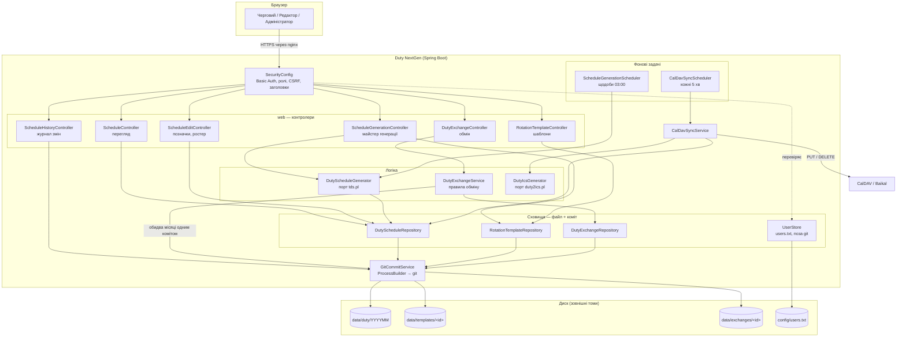
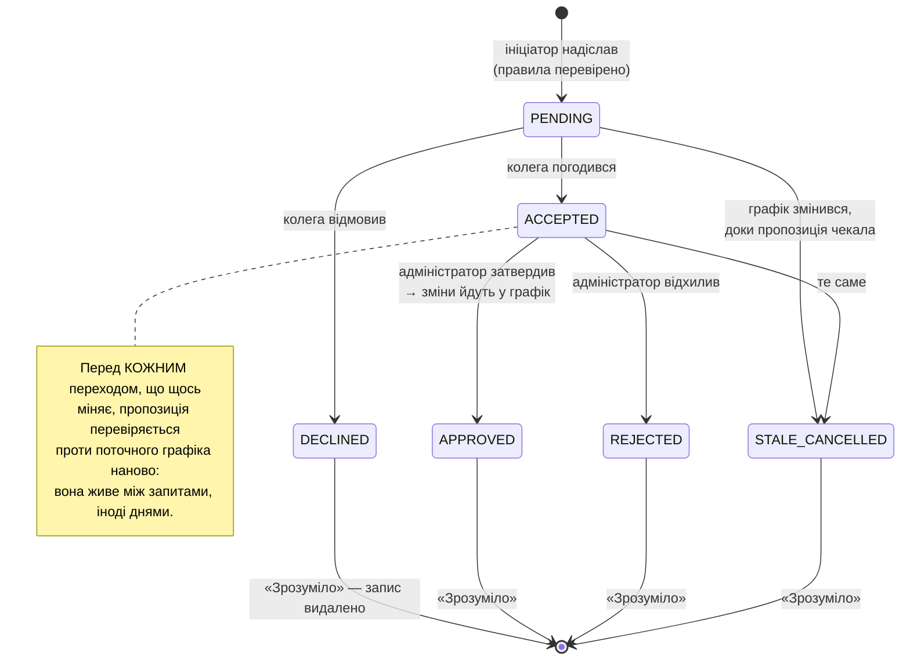
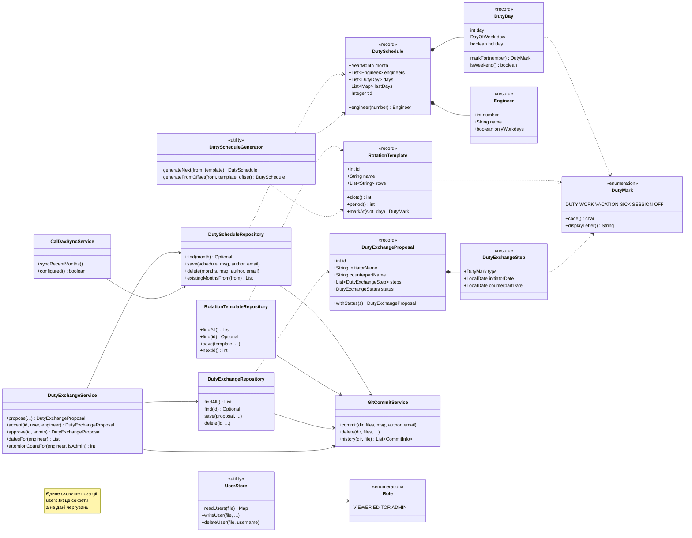

# Duty NextGen

Наступне покоління проєкту **Duty** — планування чергувань системних
адміністраторів із синхронізацією в CalDAV.

Замінює застарілу реалізацію (Perl CGI + CVS, репозиторій
[Duty](https://github.com/oldengremlin/Duty)) новим стеком на Java, зберігаючи
всю історію графіків з листопада 2008 року.

Застарілий проєкт (репозиторій `Duty`) лишається основним і продовжує
працювати незалежно від цього. `DutyNextGen` виділено з нього окремим
репозиторієм 2026-09-03 через `git subtree split` (каталог `nextgen/`
монорепо `Duty` → корінь цього репозиторію) — зі збереженням повної історії
комітів.

## Що змінюється відносно застарілого проєкту

| Було | Стає |
|---|---|
| Perl CGI (`index.pl`) | Java / Spring Boot (Thymeleaf) |
| Редагування графіка вручну через CVS-клієнт (`checkout` → `vim` → `commit` → кнопка «Refresh» на сайті) | Редагування прямо у веб-інтерфейсі |
| CVS (pserver, окремий xinetd-сервіс) | Git — лише як внутрішній, автоматичний журнал змін (кожне збереження в вебі = один коміт), непомітний для користувачів |
| Кодування даних KOI8-U | UTF-8 |
| `tds.pl` (генерація наступного місяця) | Java-порт тієї ж ротаційної логіки |
| `duty2ics.pl` + `duty-caldav-sync` (демони на shell/Perl, `sleep`-цикли) | Java-сервіс з фоновими задачами (JDK 21 virtual threads) |

Формат файлів графіка (`[ Names ]` / `[ Dates ]` / `[ LastDay0 ]` … `[ LastDayN ]`,
позначки `D`/`W`/`O`/`I`/`-`) навмисно **не змінюється** — він людинозрозумілий,
добре діффиться в git і вже перевірений з 2008 року. Змінюється лише кодування
(KOI8-U → UTF-8) та спосіб редагування. Розширений (сумісно назад) лише
двома речами: секцій `[ LastDayN ]` тепер стільки, скільки слотів у
застосованому шаблоні ротації (а не завжди рівно дві), і опціональна
секція `[ Tid ] ` — id шаблону, застосованого при генерації цього
місяця (див. розділ «Шаблони ротації»). Файли без `[ Tid ] ` (усі, що
збережено до появи шаблонів) лишаються коректними — просто це поле `null`.

## Стек

- Java 21 (Spring Boot 3.3, Maven)
- Thymeleaf — серверний рендер сторінок
- Git (зовнішній процес через `ProcessBuilder`) — внутрішня історія змін
- Без бази даних: дані — текстові файли в `data/duty/`, як і раніше

## Архітектура

### Загальний потік виконання

Що відбувається від натискання кнопки до запису на диск. Ключове: **git
викликається самим застосунком**, а не людиною — команда ніколи не робить
`checkout`/`commit` руками, на відміну від застарілого CVS-процесу.



Три речі, які варто прочитати з діаграми:

- **Кожне сховище пише через `GitCommitService`.** Виняток один —
  `UserStore`: облікові записи це секрети, а не дані чергувань, тож вони
  свідомо поза git-історією графіка.
- **Обмін чергуваннями йде в `GitCommitService` напряму**, а не через
  репозиторій графіка: пропозиція може зачепити два різні місячні файли, і
  вони мусять лягти одним комітом, інакше обмін лишиться застосованим
  наполовину.
- **Фонові задачі не мають власної логіки** — вони викликають рівно ті
  самі `DutyScheduleGenerator` і `CalDavSyncService`, що й кнопки в
  інтерфейсі. Кнопка «Синхронізувати зараз» — це той самий метод, просто
  негайно.

### Алгоритм роботи: генерація наступного місяця

Порт ротаційного алгоритму `tds.pl`, узагальнений на довільний шаблон
(K слотів замість жорстко зашитих двох). Найтонше місце — **продовження
фази**: шаблон треба «приставити» до графіка саме там, де ротація
зупинилась, а зупинилась вона там, де її залишили живі люди (чергові могли
самі помінятися днями всередині місяця), а не там, де показував би
внутрішній лічильник.


Чому хвіст `[ LastDayN ]` пишеться **сирими** значеннями шаблону, а не тим,
що показано користувачу: він потрібен лише наступній генерації, щоб знайти,
з якого місця продовжувати. Якби туди потрапили вже виправлені позначки
(скасований понеділок після чергування у неділю), пошук фази наступного
місяця просто не знайшов би такого поєднання в шаблоні.

Дерево рішень вибору шаблону й приклади — `docs/rotation-templates.md`.

### Алгоритм роботи: обмін чергуваннями

Життєвий цикл пропозиції. Стан зберігається у файлі, кожен перехід — окремий
git-коміт з автором тієї дії; окремих полів «хто і коли» в файлі нема
навмисно, це вже є в журналі.



### Структура класів

Основні типи й зв'язки між ними. `domain` — незмінні `record`-и без жодних
залежностей (ні на Spring, ні на файли); усе, що знає про диск і git, лежить
шаром нижче.



## Структура проєкту

```
DutyNextGen/
├── pom.xml                  Maven: залежності, версія (джерело правди), фільтрація application.yml
├── Dockerfile               Збірка образу; git, UTF-8-локаль, TZ, точки монтування /data і /config
├── dbuild                   Скрипт збірки й перезапуску контейнера (аналог dbuild застарілого проєкту)
├── README.md                Цей файл
├── CHANGELOG.md             Історія версій
├── CLAUDE.md                Правила розробки проєкту
├── LICENSE                  Apache License 2.0
├── docs/
│   └── rotation-templates.md    Шаблони ротації: модель, дерево рішень генерації, зміна кількості чергових
└── src/
    ├── main/java/net/ukrhub/duty/
    │   ├── DutyNextGenApplication.java   Точка входу; CLI-режим add-user до підняття Spring
    │   ├── config/
    │   │   └── DutyProperties.java       Каталоги даних і реквізити CalDAV з application.yml
    │   ├── domain/                       Моделі предметної області — незмінні record-и, без залежностей
    │   │   ├── DutySchedule.java             Графік місяця: ростер, дні, хвіст ротації, id шаблону
    │   │   ├── DutyDay.java                  Один день: число, день тижня, свято, позначки по людях
    │   │   ├── DutyMark.java                 Позначка D/W/O/I/S/- та її вигляд в інтерфейсі
    │   │   ├── Engineer.java                 Адміністратор: номер колонки, П.І.Б., «лише робочі дні»
    │   │   ├── RotationTemplate.java         Шаблон ротації: рядок на слот, символ на день періоду
    │   │   ├── DutyExchangeProposal.java     Пропозиція обміну: сторони, кроки, стан
    │   │   ├── DutyExchangeStep.java         Один елементарний обмін: тип і пара дат
    │   │   └── DutyExchangeStatus.java       Стан пропозиції та його назва для інтерфейсу
    │   ├── schedule/                     Формат, сховище й генератор графіка
    │   │   ├── DutyScheduleFormat.java       Читання/запис успадкованого текстового формату
    │   │   ├── DutyScheduleRepository.java   Файл місяця + git-коміт на кожне збереження
    │   │   ├── DutyScheduleGenerator.java    Порт ротаційного алгоритму tds.pl на довільний шаблон
    │   │   ├── ScheduleGenerationScheduler.java  Фонова генерація наступного місяця (щодоби о 03:00)
    │   │   └── ScheduleGenerationException.java  Причина невдалої генерації — текст для адміністратора
    │   ├── template/                     Шаблони ротації
    │   │   ├── RotationTemplateFormat.java       Читання/запис [ Name ] / [ Pattern ]
    │   │   └── RotationTemplateRepository.java   Файл шаблону + git-коміт
    │   ├── exchange/                     Обмін чергуваннями
    │   │   ├── DutyExchangeService.java          Уся бізнес-логіка: правила, переходи станів, застосування
    │   │   ├── DutyExchangeRepository.java       Файл пропозиції + git-коміт
    │   │   ├── DutyExchangeFormat.java           Читання/запис формату пропозиції
    │   │   ├── DutyExchangeDraftStore.java       Чернетка конструктора — у пам'яті, не версіюється
    │   │   ├── DutySwappableDate.java            Дата, доступна до обміну (обчислюється щоразу наново)
    │   │   └── DutyExchangeValidationException.java  Порушення правила обміну — текст для користувача
    │   ├── git/                          Внутрішній журнал змін
    │   │   ├── GitCommitService.java             Виклик git як зовнішнього процесу: commit/delete/history
    │   │   └── CommitInfo.java                   Один запис історії: хто/коли/що + діфф
    │   ├── caldav/                       Синхронізація з Baikal
    │   │   ├── CalDavSyncService.java            Порівняння за хешем, PUT змінених, DELETE зниклих
    │   │   ├── CalDavSyncScheduler.java          Фоновий прогін кожні 5 хвилин
    │   │   ├── CalDavClient.java                 PUT/DELETE ICS через HttpClient
    │   │   ├── DigestAuth.java                   Заголовок Authorization: Digest (RFC 2617) або Basic
    │   │   ├── CalDavSyncState.java              Стан синку: UID → хеш, файл на місяць
    │   │   ├── CaldavConfFile.java               duty-caldav.conf — той самий формат, що й у оригіналу
    │   │   ├── DutyIcsGenerator.java             Порт duty2ics.pl: графік → список подій
    │   │   └── IcsEvent.java                     Одна подія: UID, дата, тіло VCALENDAR
    │   ├── auth/                         Автентифікація й облікові записи
    │   │   ├── SecurityConfig.java               Basic Auth, правила доступу за URL, заголовки безпеки
    │   │   ├── FileUserDetailsService.java       Вхід за users.txt (читається на кожен запит)
    │   │   ├── UserStore.java                    Читання/запис users.txt, права rw-------, валідація полів
    │   │   ├── UserAdminController.java          /admin/users — керування записами через веб
    │   │   ├── UserAdminCli.java                 add-user — перший (бутстрапний) адміністратор
    │   │   ├── UserLinkService.java              Прив'язка «користувач → інженер», перенос при перейменуванні
    │   │   ├── Role.java                         VIEWER / EDITOR / ADMIN
    │   │   └── RoleCheck.java                    Перевірка ролі там, де URL-матчер не розрізняє поля
    │   └── web/                          Контролери й допоміжне для шаблонів
    │       ├── ScheduleController.java           GET /schedule/YYYYMM — перегляд
    │       ├── ScheduleEditController.java       Редагування позначок, П.І.Б., ростеру
    │       ├── ScheduleGenerationController.java Майстер генерації наступного місяця й видалення
    │       ├── ScheduleHistoryController.java    /history — git-журнал з кольоровим діффом
    │       ├── DutyExchangeController.java       /exchange — конструктор і журнал пропозицій
    │       ├── DutyExchangeNoticeAdvice.java     Бейдж «потребує уваги» на кожній сторінці
    │       ├── RotationTemplateController.java   /admin/templates — CRUD шаблонів
    │       ├── CalDavSyncController.java         Кнопка «Синхронізувати зараз»
    │       ├── MonthPath.java                    Розбір/форматування YYYYMM у шляхах
    │       ├── DiffLine.java                     Рядок діффа з CSS-класом
    │       └── UkrainianCalendar.java            Українські назви місяців і днів тижня
    ├── main/resources/
    │   ├── application.yml               Порт, каталоги, CalDAV, версія (Maven-фільтрація)
    │   ├── templates/                    Thymeleaf: schedule, schedule-edit, schedule-history,
    │   │                                 exchange, admin-users, templates-list, template-new,
    │   │                                 template-edit, schedule-generate-templates/-offset
    │   └── static/
    │       ├── css/schedule.css          Стилі всіх сторінок, разом із друком
    │       └── js/                       copy-for-email.js (HTML-фрагмент у буфер), table-hover.js
    └── test/java/net/ukrhub/duty/        Дзеркалить структуру main; 181 тест
        └── ...                           Плюс FakeCalDavServer (Digest-сервер у пам'яті)
            і UserStoreTestHelper (доступ до пакетно-приватного UserStore з інших пакетів)
```

Каталоги даних (`data/duty`, `data/templates`, `data/exchanges`, `config`) у
репозиторії не лежать — вони створюються при роботі й монтуються ззовні;
дивись розділ «Дані та історія».

## Статус

Версіонування — [Semantic Versioning](https://semver.org/lang/uk/),
джерело правди — `pom.xml`. Та сама версія завжди видна у футері сторінки
графіка (`http://localhost:8080/schedule/YYYYMM`) — підставляється туди
Maven-фільтрацією при збірці, вручну синхронізувати нічого не треба. Дивись
`CHANGELOG.md` — що вже реалізовано.

## Збірка та запуск

```sh
mvn spring-boot:run
```

За замовчуванням піднімається на `http://localhost:8080`.

Каталог з даними графіка задається змінною середовища `DUTY_DATA_DIR`
(за замовчуванням `./data/duty`), каталог конфігурації (облікові записи
веб-автентифікації) — `DUTY_CONFIG_DIR` (за замовчуванням `./config`),
каталог шаблонів ротації — `DUTY_TEMPLATES_DIR` (за замовчуванням
`./data/templates`) — детальніше нижче, розділ «Шаблони ротації»,
каталог пропозицій обміну чергуваннями — `DUTY_EXCHANGES_DIR` (за
замовчуванням `./data/exchanges`) — розділ «Обмін чергуваннями».
Налаштування CalDAV — або файл `<config-dir>/duty-caldav.conf`, або
змінні середовища `DUTY_CALDAV_BASE_URL`/`DUTY_CALDAV_USER`/
`DUTY_CALDAV_PASSWORD`, плюс `DUTY_CALDAV_STATE_DIR` (кеш стану синку,
за замовчуванням `./data/caldav-state`) — детальніше нижче, розділ
«CalDAV-синхронізація».

**Важливо:** JVM обов'язково запускати з UTF-8-локаллю (`LANG=C.UTF-8` або
подібне). `GitCommitService` передає кириличні імена авторів і повідомлення
комітів дочірньому процесу `git` через native-кодування JVM
(`sun.jnu.encoding`), а не через `file.encoding` — без UTF-8-локалі кирилиця
мовчки пошкодиться. Якщо локаль неправильна, застосунок падає одразу при
старті з поясненням, що робити.

Збереження без реальних змін (повторне "Зберегти" з тим самим вмістом) —
безпечний no-op, а не помилка: `GitCommitService` окремо розпізнає "нема
чого комітити" від git і не кидає виняток у цьому випадку.

У деяких контейнерних середовищах спавн дочірнього git-процесу зрідка
падає транзиентно (`IOException: Exec failed, error: 2`) ще до запуску
самої команди — і саме на командах з додатковими env-змінними (автор/
дата коміту). Корінна причина лишається невідомою: ні абсолютний шлях
до `git` (без пошуку через `PATH`), ні `-Djdk.lang.Process.launchMechanism=FORK`
замість типового `posix_spawn` (Dockerfile) не усунули збій — обидві
гіпотези перевірені й спростовані реальними production-логами. Це,
найімовірніше, щось на рівні контейнера/JVM (`ProcessImpl`/
`jspawnhelper`), недоступне для діагностики без прямого доступу до
контейнера в момент збою. Тому підхід — не "полювання" за причиною, а
надійна деградація: `GitCommitService.execute()` повторює `pb.start()`
до п'яти разів із наростаючою паузою; якщо все ж не вдалось —
`DutyExchangeController` показує дружнє повідомлення замість Whitelabel
Error Page, а `GitCommitService.delete()` додатково відновлює робочий
каталог і індекс до стану останнього коміту (`git checkout HEAD --
...`), якщо `git commit` не пройшов після `git rm` — інакше файл
лишався б фізично видаленим, хоча дію показано як невдалу.

## Веб-перегляд графіка

Футер сторінки (`Duty NextGen ${appVersion}`) — посилання на
репозиторій проєкту (https://github.com/oldengremlin/DutyNextGen).

`GET /` перенаправляє на поточний місяць, `GET /schedule/YYYYMM` — конкретний.
Таблиця: адміністратори рядками, дні місяця колонками, кольорові позначки
(Ч — чергування, Р — робочий день, В — відпустка, Л — лікарняний),
вихідні й сьогоднішній день підсвічені; рядок і стовпець під курсором миші —
теж (`static/js/table-hover.js`, те саме й у формі редагування). Друк —
тим самим шаблоном, через `@media print` (окремої сторінки/кнопки навмисно
нема — простіше в підтримці, і завжди синхронно з екранною версією):
браузерне «Друкувати» / Ctrl+P ховає навігацію й друкує в альбомній
орієнтації. Рамка навколо сьогоднішнього дня в друк не йде (`box-shadow:
none` для `.today` у `@media print`) — на аркуші, який іде далі, в
обліковий відділ, "сьогодні" відправника не має сенсу й лише плутає.
Таблиця в друкованому вигляді — на `table-layout: fixed`
(а не на екранний `min-width`/`nowrap` по вмісту): 28-31 денна колонка
разом із колонкою імен інакше ширші за будь-яку фізичну сторінку, і
браузер сам не стискає це під ширину аркуша (лише вручну, «Заповнити
по ширині») — без `fixed` таблицю просто обрізало б праворуч.

Кнопка **«Копіювати для листа»** (доступна всім, як і сам перегляд) кладе
таблицю в буфер обміну як HTML — вставити прямо в лист (Thunderbird тощо)
одним Ctrl+V, з кольоровими позначками, але без кнопок керування й без
рамки поточного дня (та сама причина, що й у друку вище — одержувачу
листа "сьогодні" відправника ні до чого). Технічно — прихований клон
`.page` без `.noprint`-елементів і класу `.today`, копіюється через
`document.execCommand('copy')` (`static/js/copy-for-email.js`): сучасний
`navigator.clipboard.write()` дав би надійніший результат, але вимагає
HTTPS, а сайт поки що лише на `http`.

## Ролі й доступ

Три ролі (`Role`), керуються через `/admin/users`:

| Роль | Перегляд | Позначки по днях | П.І.Б. / тип / ростер | `/admin/users` |
|---|---|---|---|---|
| Користувач | так | — | — | — |
| Редактор | так | так | — | — |
| Адміністратор | так | так | так | так |

Роль зберігається в `users.txt` третім полем (`ім'я:bcrypt-хеш:РОЛЬ`).
Обмеження за роллю — і на рівні URL (`SecurityConfig`: `/schedule/*/edit`
потребує Редактора/Адміністратора, `/admin/**` і додавання/видалення
адміністраторів з ростеру — лише Адміністратора), і додатково в самому
контролері форми позначок (та сама адреса, що й позначки, тож URL-матчер
не розрізняє поля П.І.Б. від поля позначки) — сервер ігнорує ці поля від
не-адміністратора, а не лише ховає їх у формі.

### Облікові записи й паролі

- **Пароль — щонайменше 8 символів.** Однакове обмеження і у веб-формі
  (`/admin/users`, і при створенні, і при скиданні), і в CLI
  (`add-user`), щоб CLI не був лазівкою повз політику.
- **`users.txt` пишеться з правами `rw-------`.** Файл містить
  bcrypt-хеші, а з типовим umask ліг би як `rw-r--r--` — тобто читався б
  будь-яким процесом у контейнері й будь-ким, хто має доступ до
  змонтованого тому `/config`.
- **Ім'я користувача й ім'я прив'язаного інженера не можуть містити
  `:` чи перенесення рядка** — це роздільники полів формату, і без
  перевірки такий запис розпався б при наступному читанні на чужі поля
  (тобто дозволив би підсунути власний хеш і роль `ADMIN`). Форма
  відповідає зрозумілим 400.
- **Пошкоджений рядок не блокує вхід усім.** Невідома роль у файлі
  (ручна правка з помилкою) понижується до `Користувача` із
  попередженням у лог, замість того щоб винятком з парсера зробити
  автентифікацію недоступною для всіх.

### Заголовки безпеки

Застосунок сам віддає `Content-Security-Policy` (жодного зовнішнього
походження, `object-src 'none'`, `base-uri`/`form-action 'self'`,
`frame-ancestors 'none'`) і `Referrer-Policy: same-origin`, поверх
типових для Spring Security `X-Content-Type-Options: nosniff` і
`X-Frame-Options: DENY`. CSRF увімкнено (токен у кожній формі).

`Strict-Transport-Security` навмисно **вимкнено**: TLS завершується на
реверс-проксі, і саме там цей заголовок має сенс задавати — застосунок
за проксі бачить звичайний http і нав'язав би політику для всього домену
від свого імені. Так само поза межами застосунку лишається обмеження
частоти спроб входу: HTTP Basic не має ні лічильника спроб, ні затримки,
тож захист від підбору — це `limit_req`/`fail2ban` на nginx.

### Прив'язка "Користувача" до адміністратора

На `/admin/users` кожного користувача можна прив'язати до конкретного
адміністратора (інженера) — за поточним П.І.Б., яке зберігається
четвертим полем у `users.txt`. Це навмисно **лише сам факт зв'язку**:
дані й можливість їх виставити (випадаючий список із іменами інженерів
поточного місяця — і при створенні користувача, і окремим ендпоінтом
`POST /admin/users/{username}/link` для вже наявних) — без жодної
логіки, яка б щось із цим зв'язком *робила*; прив'язка сама собою не
додає й не забирає прав.

Прив'язка — за іменем, бо це єдині дані, які вже є і не треба вигадувати
заново, але це свідомо крихкий зв'язок: якщо адміністратор виправляє
чиєсь П.І.Б. у формі редагування графіка (напр. літеру: "Леонов" →
"Лєонов"), `UserLinkService` автоматично переносить прив'язку будь-якого
пов'язаного користувача на нове ім'я — інакше вона тихо розірвалася б.
Історичні місяці при цьому не враховуються: важливі лише поточні П.І.Б.
та поточні користувачі.

## Веб-редагування графіка

`GET /schedule/YYYYMM/edit` (кнопка «Редагувати» на сторінці перегляду,
видима Редактору й Адміністратору) — форма редагування наявного місяця:
позначки по днях (Ч/Р/В/Л/С/вихідний) — усім, кому доступна форма; П.І.Б.,
ознака «лише робочі дні» та додавання/видалення адміністраторів з
ростеру («Додати адміністратора» внизу форми, кнопка «Видалити» в
кожному рядку) — лише Адміністратору. Кожне збереження — окремий
git-коміт з іменем користувача, який зайшов через Basic Auth; додавання/
видалення адміністратора — свій власний коміт, окремо від збереження
позначок. Створення графіка на новий місяць — окрема функція, див.
розділ «Генерація та видалення графіка» нижче.

Свято (успадкований з застарілого проєкту маркер `*` після дня тижня,
напр. 1 травня) підсвічується в таблиці окремим кольором; проставити чи
зняти цю позначку можна на **будь-який** день місяця прямо у формі
редагування (чекбокс під числом дня) — необов'язково вихідний.

**Правило:** у вихідний чи святковий день жоден адміністратор не може
мати позначку «Робочий день» (той самий принцип, за яким `tds.pl`
у застарілому проєкті завжди примусово ставив `-` замість `W` на
суботу/неділю). Форма перевіряє це при збереженні — якщо порушено,
нічого не зберігається, і показується, що саме виправити.

## Генерація та видалення графіка

Порт ротаційного алгоритму `tds.pl` застарілого проєкту
(`DutyScheduleGenerator`), узагальнений на довільний шаблон ротації
(`RotationTemplate`, розділ «Шаблони ротації» нижче) — K "чергових"
адміністраторів (без ознаки «лише робочі дні»), K не обмежене двома;
решта просто працює в будні (Р) і має вихідний у суботу/неділю. Продовжує
ротацію з того місця, де вона зупинилась минулого місяця: наприкінці
кожного місяця в файлі зберігаються позначки чергових за K останніх днів
(`[ LastDay0 ]` … `[ LastDayK-1 ]`, у порядку від найстарішого до
найновішого — `[ LastDayK-1 ]` це завжди справжній останній день місяця,
та сама конвенція, що й у застарілому двослотовому форматі), і генератор
шукає в застосованому шаблоні (циклічно розтягнутому на потрібну
довжину), де ці K позначок йдуть поспіль — знайдена фаза й визначає
ротацію на наступний місяць, день за днем. Разом із самим графіком у файл записується й `[ Tid ] ` —
id шаблону, застосованого для цього місяця (завжди, і при автоматичній
генерації, і при ручному виборі — інакше фоновій генерації наступного
разу нема на що спертись). Якщо вхідні дані не відповідають передумовам
(кількість чергових не збігається з кількістю слотів шаблону, чи фазу не
вдалось визначити за зіпсованими `[ LastDay0 ]` … `[ LastDayK-1 ]`) —
зрозуміла помилка над таблицею графіка, а не мовчазне вгадування чи
поламаний графік.

**Обов'язкове правило понеділка.** Якщо черговий чергував (Ч) у суботу чи
неділю, у понеділок його «Робочий день» із шаблону скасовується — понеділок
завжди стає для нього вихідним, незалежно від того, що каже шаблон (сам
черговий міг лише домовитися з кимось і помінятися днями — це поза межами
коду). Діє завжди, для будь-якого шаблону, і не залежить від того, чи
кратний період шаблону 7 дням: генератор дивиться на фактичні позначки
суботи й неділі (ковзне вікно, коректно продовжене через межу місяців), а
не на позицію в шаблоні. На "сирі" значення шаблону, які зберігаються в
`[ LastDayN ]` для продовження фази наступного місяця, це правило не
впливає — виправляється лише те, що бачить користувач.

- **Кнопка «Згенерувати {наступний місяць}»** на сторінці перегляду —
  лише Адміністратору, з'являється, коли графік наступного місяця ще не
  існує (`GET`/`POST /schedule/{ym}/generate-next`). Прив'язана до
  конкретного переглянутого місяця `ym`, а не до "сьогодні": можна
  перейти на вже згенерований жовтень і згенерувати з нього листопад, і
  так по ланцюжку на скільки завгодно місяців уперед. Визначає K
  (кількість чергових без ознаки «лише робочі дні») і шукає шаблони з
  такою ж кількістю слотів:
  - **Нема жодного** — помилка над таблицею графіка, генерація вручну
    через редагування.
  - **Рівно один** — без діалогу вибору шаблону (він і так однозначний),
    одразу продовжує графік цим шаблоном (пошук фази за `[ LastDayN ]`,
    як і раніше). Якщо фазу продовжити не вдалось (типово — K щойно
    змінилось, і збережений хвіст ще старого розміру) — не гола помилка,
    а одразу крок 2 нижче (вибір дня періоду) для цього ж шаблону.
  - **Два і більше** — завжди питає (незалежно від того, що записано в
    `[ Tid ] ` місяця, з якого генеруємо: ручний вибір — свідома дія
    людини, а не спроба вгадати "той самий, що минулого разу"), двома
    кроками:
    1. **Який шаблон?** (`GET`/`POST /schedule/{ym}/generate-next/templates`)
       — перелік із наочною візуалізацією кожного (той самий вигляд
       міні-гріду, що на `/admin/templates`), а не голі id.
    2. **З якого дня періоду почати?** (`GET`/`POST
       /schedule/{ym}/generate-next/offset`) — кожен можливий зсув
       показаний як реальний хвіст поточного місяця + продовження цим
       варіантом (типово 2-5 варіантів для реалістичної довжини
       періоду), клітинки суботи/неділі підкреслені окремо (і хвіст, і
       початок продовження — реальні календарні дні, тож дні тижня
       відомі заздалегідь) — обрати з візуального переліку простіше,
       ніж із абстрактного "введи зсув". Генерація після вибору — вже
       без пошуку фази, з обраного зсуву напряму (`[ Tid ] ` нового
       місяця = id обраного шаблону).
- **Фоновий job** (`ScheduleGenerationScheduler`, `@Scheduled`, раз на
  добу о 03:00) — аналог старого cron + `monthly-duty`-демона: якщо
  графіка на місяць, наступний за поточним реальним, ще нема — читає
  `[ Tid ] ` поточного місяця й продовжує рівно той самий шаблон.
  Ніколи нічого не питає (він безголовий) і ніколи не вгадує заміну:
  якщо `[ Tid ] ` відсутній (місяць старіший за появу шаблонів чи
  збережений вручну) або кількість чергових розійшлася з кількістю
  слотів цього шаблону (адміністратора додали/зняли ознаку «лише робочі
  дні», але не встигли перегенерувати наступний місяць вручну) —
  просто пропускає (лог-попередження, без винятку). Виправлення в
  цьому випадку — ручна дія: видалити невдало згенерований місяць і
  натиснути «Згенерувати» знову (кнопка вище тоді сама покаже діалог
  вибору шаблону). Кнопка вище — так само резерв на випадок, якщо
  фонова перевірка колись не спрацює, і спосіб згенерувати наперед
  більше ніж на один місяць одразу.
- **Кнопка «Видалити місяць»** — лише Адміністратору, лише для місяців,
  пізніших за поточний реальний (сьогодні вересень — можна видалити
  жовтень, листопад тощо, але не сам вересень і не будь-який минулий
  місяць). Видалення каскадне: видаляючи, скажімо, жовтень, автоматично
  видаляються й усі наявні наступні місяці (листопад, грудень, ...) —
  одна дія користувача, один git-коміт (`POST /schedule/{ym}/delete`).
  Обмеження "лише майбутні місяці" й "лише ADMIN" перевіряються в самому
  контролері, а не лише приховуванням кнопки — прямий запит в обхід
  інтерфейсу (curl і подібне) на минулий/поточний місяць чи від не-ADMIN
  так само відхиляється (400/403).

## Шаблони ротації

Редактор довільних шаблонів ротації чергувань (`net.ukrhub.duty.template`,
`RotationTemplateController`, `/admin/templates`, лише ADMIN) — на заміну
колишньому жорстко зашитому в `DutyScheduleGenerator` єдиному 2-денному
патерну. Створені тут шаблони одразу застосовні до генерації графіка —
див. розділ «Генерація та видалення графіка» вище (мапінг "слот шаблону
→ адміністратор" — за `Engineer.number()`, у порядку сортування, без
ознаки «лише робочі дні»; перехід між шаблонами при зміні кількості
чергових — ручний, через діалог вибору шаблону на кнопці «Згенерувати»).

- **Модель шаблону.** Назва (унікальна лише за зручністю, не ключ),
  кількість слотів `K` (абстрактних ротаційних позицій, не прив'язаних
  до конкретного адміністратора) і період — по одному рядку на слот,
  символи `D`/`W`/`-` (без `O`/`I`/`S`: сесія/лікарняний/відпустка —
  подія в житті конкретної людини, не властивість шаблону). Довжина
  періоду не обмежена й не обов'язково мінімальна — можна намалювати
  хоч короткий повторюваний фрагмент, хоч одразу довший блок, як
  зручніше думати (`RotationTemplate`).
- **Створення — двокроково.** Спершу питаємо "на скільки чергових
  розраховуємо шаблон?" (`K` фіксується один раз і більше не
  змінюється), потім відкривається грід під цю кількість слотів,
  спочатку з періодом в 1 день — довжину періоду розширюють/скорочують
  кнопками "+ день"/"− день" (`POST /admin/templates/{id}/add-day` /
  `.../remove-day`), кожна клітинка — `<select>` D/W/−, той самий
  підхід, що й у звичайному редагуванні графіка
  (`schedule-edit.html`) — свідомо без клікабельного циклювання
  клітинок, простіше в підтримці.
- **Зберігання — текстові файли з git-історією**, той самий підхід, що
  й у самого графіка: `RotationTemplateRepository` пише
  `<templates-dir>/<id>` (секції `[ Name ]` / `[ Pattern ] `,
  `RotationTemplateFormat`) і комітить через той самий
  `GitCommitService` — редагування шаблону так само лишає слід в
  історії, як і редагування графіка. `templates-dir` — типово
  підкаталог `data-dir` (`DUTY_TEMPLATES_DIR`, за замовчуванням
  `./data/templates`; у Docker — `/data/templates`, той самий
  змонтований том, що й графік, без окремого тому).
- **Список шаблонів** (`GET /admin/templates`) показує кожен шаблон із
  наочним прев'ю — рядок на слот, кольорові клітинки D/W/−, той самий
  вигляд, що й позначки на графіку — а не просто рядок таблиці.
  Сортування — за кількістю слотів (2, 3, 4...), у межах однієї
  кількості — за id (порядком створення).

## CalDAV-синхронізація

Порт застарілих `duty2ics.pl` (перетворення графіка на ICS-події) +
`duty-caldav-sync` (публікація в CalDAV) — пакет `net.ukrhub.duty.caldav`.
Вимкнено за замовчуванням: доки `DUTY_CALDAV_BASE_URL` порожній, ні
фоновий job, ні кнопка нічого не роблять.

- **Що публікується.** Для попереднього, поточного й наступного місяця
  (усі дні місяця, без фільтра "від сьогодні й далі") — по одній події
  на кожну активну позначку (D/W/O/I/S) кожного адміністратора:
  чергування (D) — 8:00–20:00, робочий день (W) — 9:00–17:30
  (у п'ятницю коротше, до 17:00), відпустка (O) / лікарняний (I) /
  сесія (S, розширення nextgen — старий скрипт про неї не знав) — подія
  на весь день. UID детермінований —
  `duty-YYYYMMDD-НОМЕР@duty.ukrhub.net`, той самий формат, що й раніше:
  продовжує (не задвоює) уже опубліковані в Baikal події. Кожна подія
  отримує `CATEGORIES` — той самий текст, що й у `SUMMARY` ("Чергування",
  "Робочий день", "Відпустка", "Лікарняний", "Сесія") — навмисно
  збігається з уже наявною в реальному Baikal-календарі вручну заведеною
  категорією "Відпустка", щоб події об'єднувались в одну категорію в
  клієнті (Thunderbird тощо), а не заводили паралельний ярлик.
- **Коли.** `CalDavSyncScheduler` — фоновий аналог старого
  нескінченного циклу `duty-caldav-sync` (`sleep 300`, без cron) — той
  самий інтервал, 5 хвилин. Кнопка «Синхронізувати зараз» на
  `/admin/users` (лише ADMIN) — резерв, якщо треба негайно, а не через
  до 5 хвилин.
- **Ідемпотентність, видалення й правки заднім числом.** PUT лише якщо
  вміст події змінився (за хешем — `net.ukrhub.duty.caldav.CalDavSyncState`,
  окремий файл стану на місяць у `DUTY_CALDAV_STATE_DIR`); DELETE подій,
  чиї позначки зникли з графіка — без винятків для минулих днів. На
  відміну від застарілого `duty2ics.pl`/`duty-caldav-sync` (де "минуле
  ніколи не чіпаємо" було потрібне лише тому, що їхній генератор сам
  фільтрував за "сьогодні", й дні "старіли" з поля зору), тут
  `DutyIcsGenerator` віддає всі дні місяця без фільтра — тож позначку,
  яку проставили заднім числом (наприклад, лікарняний оформили
  постфактум), синк реально підхопить і опублікує чи видалить. Єдиний
  захист від зайвого перегляду старої історії — межа самого вікна
  синхронізації (три місяці: попередній, поточний, наступний); хеш
  гарантує, що незмінене повторно нікуди не відправляється. Те саме
  DELETE спрацьовує й при видаленні адміністратора з графіка місяця
  (`/schedule/{ym}/edit/remove-engineer`) — прибраний з `engineers()`
  адміністратор просто не з'являється в наступній генерації подій, тож
  усі вже опубліковані події за ним зникають із `newState` і
  видаляються так само, як і при знятті позначки.
- **Автентифікація** — Basic або Digest (RFC 2617, `qop=auth`),
  залежно від того, що сервер запропонує у виклику; застарілий скрипт
  ходив у Baikal через `curl --digest`, тож підтримка Digest — не
  "про всяк випадок", а те, що вже перевірено працює з реальним
  сервером. Рахується вручну (`DigestAuth`), без
  `java.net.Authenticator.setDefault` — той глобальний для всього
  JVM-процесу.
- **Налаштування** — двома способами, перевіряються в цьому порядку:
  1. Файл `<config-dir>/duty-caldav.conf` — той самий формат
     (`CALDAV_BASE_URL="..."` / `CALDAV_USER="..."` / `CALDAV_PASS="..."`,
     рядки `KEY="value"`, `#` — коментар), яким користувався застарілий
     `duty-caldav-sync` (`CaldavConfFile`). Найпростіший спосіб —
     покласти цей файл (як і раніше, поза CVS/git) прямо в уже
     змонтований том `/config`, нічого більше не змінюючи; `DUTY_DIR`/
     `STATE_DIR` з файлу ігноруються — у nextgen для цього свої шляхи
     (`duty.data-dir`, `DUTY_CALDAV_STATE_DIR`, нижче).
  2. Змінні середовища `DUTY_CALDAV_BASE_URL`
     (напр. `https://host:7580/dav.php/calendars/USER/CALENDAR`),
     `DUTY_CALDAV_USER`, `DUTY_CALDAV_PASSWORD` — мають пріоритет над
     файлом, якщо задані обидва способи.

  Окремо — `DUTY_CALDAV_STATE_DIR` (кеш стану синку: опубліковані UID +
  хеші вмісту; не облікові дані й не графік, можна безпечно стерти) —
  у Docker-образі типово `/config/caldav-state`, усередині вже
  змонтованого тому конфігурації.

## Історія змін

`GET /schedule/YYYYMM/history` (посилання «Історія» на сторінці
перегляду) — хто, коли і що саме змінив у графіку конкретного місяця.
Нічого окремо не зберігається — дані напряму з git-журналу
(`git log --follow --patch`, один зовнішній процес на всю сторінку),
кольоровий diff по кожній зміні. Видимість — як у самого перегляду
графіка (будь-який автентифікований користувач).

## Первинна ініціалізація

Весь застосунок захищено HTTP Basic Auth — жодна сторінка не відкривається
без входу. За замовчуванням користувачів немає взагалі (файл
`<config-dir>/users.txt` не існує) — це означає, що **все повертає 401**,
доки не буде створено першого (адміністративного) користувача.

Це — і лише це — робиться через CLI-режим того самого jar, без піднімання
веб-сервера:

```sh
DUTY_CONFIG_DIR=/шлях/до/config java -jar duty-nextgen.jar add-user noc
Пароль для 'noc': ********
Повторіть пароль: ********
Користувача 'noc' (роль: Адміністратор) збережено в /шлях/до/config/users.txt
```

**Ця команда працює лише один раз** — доки `users.txt` порожній. Якщо в
ньому вже є хоч один користувач, вона відмовляє: усіх наступних
(з будь-якою роллю) заводить перший адміністратор через `/admin/users`.
Аварійне відновлення (усіх адміністраторів випадково видалено, файл
пошкоджено) — спорожнити/видалити `users.txt` вручну (`docker exec` і
текстовий редактор чи просто `rm`) і виконати `add-user` ще раз.

**Адміністратор не може змінити самого себе** — ні видалити
(`UserAdminController.delete`), ні змінити власну роль
(`UserAdminController.changeRole`), незалежно від того, скільки ще є
адміністраторів у системі. Обидві перевірки — на рівні контролера, а не
лише відсутність відповідної дії в UI. Причина обмежувати це безумовно,
а не лише "коли я останній": навіть маючи колегу-адміна, самому собі
за один клік прибрати права — завжди небажаний випадок (перевірено на
практиці) — сесія одразу стає нічим не кориснішою за звичайного
користувача, хоч формально систему в цілому це й не замикає. Змінити
роль чи видалити конкретного адміністратора може лише **інший**
адміністратор.

Додатково, і вже незалежно від самозаборони: **у системі завжди має
лишатися хоча б один адміністратор** — знизити роль чи видалити
останнього адміністратора, що лишився, не можна навіть через іншого
адміністратора (хоча за наявної самозаборони ця гілка через веб-інтерфейс
і так недосяжна — останній адміністратор це завжди він сам).

Пароль зберігається як bcrypt-хеш у `users.txt` — файл із рядками
`ім'я:bcrypt-хеш:роль:прив'язаний_інженер`, по одному користувачу на
рядок (рядки без ролі, записані до появи цього поля, трактуються як
Адміністратор — попередня поведінка єдиного користувача, без пониження
прав при оновленні; четверте поле — прив'язка до адміністратора,
див. розділ «Ролі й доступ» — необов'язкове й може бути порожнім). Цей
файл **не git-версіюється** (на відміну від `data/duty/`) — це облікові
дані, а не графік. Тримати його на зовнішньому томі разом з `config-dir`
(див. нижче про Docker) і за потреби бекапити окремо.

Чому Basic, а не Digest: Digest-автентифікація в Spring Security фактично
застаріла (MD5, без активної підтримки), а Basic поверх HTTPS дає той
самий практичний рівень захисту, простіше і краще підтримується.
**Розгортати обов'язково за TLS** (реверс-проксі на кшталт nginx/Traefik
попереду) — Basic без HTTPS передає пароль у base64, що еквівалентно
відкритому тексту в мережі.

### Вихід («Вийти»)

Кнопка «Вийти» є на кожній сторінці (`POST /logout`). У HTTP Basic
немає поняття "вийти" на рівні протоколу — облікові дані кешує сам
браузер і надсилає їх повторно автоматично з кожним наступним запитом,
доки вкладку не закрито. Тому `/logout` робить те єдине, що дійсно може
зробити сервер: інвалідує сесію (Spring Security) і повертає 401 замість
редиректу на неіснуючу сторінку логіну — сторінка відповіді чесно
попереджає, що браузер, найімовірніше, все одно повторно авторизується
сам, і щоб дійсно змінити користувача, треба закрити всі вкладки цього
сайту або скористатись приватним/інкогніто-вікном.

## Запуск у Docker

```sh
./dbuild
```

Збирає образ (`Dockerfile`, multi-stage: збірка Maven → рантайм на
`eclipse-temurin:21-jre-jammy` з встановленим `git`) і запускає контейнер —
за тим самим принципом, що й `dbuild` кореневого застарілого проєкту.

`data/` і `config/` — **зовнішні томи, у образ не запікаються**
(`-v /safe/duty-nextgen/data:/data -v /safe/duty-nextgen/config:/config`
у `dbuild`; заміни шляхи на реальні перед першим запуском). Усередині
контейнера `DUTY_DATA_DIR=/data`, `DUTY_CONFIG_DIR=/config` вже
виставлені змінними середовища в образі — тобто файли графіка
(`YYYYMM`) кладуться **прямо** в змонтований хост-каталог `data/`, без
жодної вкладеної підпапки (на відміну від локального dev-запуску, де
за замовчуванням `./data/duty`).

Після першого запуску — первинна ініціалізація (створення користувача)
прямо в контейнері:

```sh
docker exec -it duty-nextgen java -jar /app/app.jar add-user noc
```

`LANG=C.UTF-8` виставлено в образі — та сама вимога щодо UTF-8-локалі, що
й вище. `TZ=Europe/Kiev` теж виставлено в образі — без цього JVM типово
рахує час за UTC, а "сьогодні"/"поточний місяць" (`LocalDate.now()`,
`YearMonth.now()`) впливають і на генерацію графіка, і на межі
CalDAV-синхронізації (див. розділ вище).

### За реверс-проксі (nginx тощо)

`server.forward-headers-strategy: framework` (`application.yml`) увімкнено
завжди — без нього контейнер під час редиректу (`redirect:/schedule/...`
на `/`, чи будь-де ще) будує абсолютний URL з **власного** `host:port`,
яким його бачить контейнер (наприклад, `duty-nextgen.events-network:8080`
у Docker-мережі) — і саме туди піде браузер клієнта, а не на публічну
адресу. З цим налаштуванням Spring натомість читає реальний зовнішній
хост із заголовків `X-Forwarded-*`, які проксі має передавати:

```nginx
location / {
    proxy_set_header X-Forwarded-Host  $host:$server_port;
    proxy_set_header X-Forwarded-Proto $scheme;
    proxy_set_header X-Forwarded-For   $proxy_add_x_forwarded_for;
    proxy_pass http://duty-nextgen:8080;
}
```

`X-Forwarded-Proto` — обов'язково, навіть якщо зараз лише `http`: без
нього Spring підставляє схему з'єднання проксі → контейнер (типово
`http`), і якщо реверс-проксі згодом термінує TLS, усі згенеровані
посилання й далі будуть `http://`, поки не додати цей заголовок.

## Дані та історія

Реальні графіки чергувань (`data/duty/`) свідомо **не** зберігаються в
цьому репозиторії — це персональні дані (П.І.Б. адміністраторів), і
відкритий публічний репозиторій не місце для них. Каталог порожній і
наповнюється самим застосунком під час роботи: локально при розробці —
прямо в `./data/duty` (типовий шлях за замовчуванням, дивись розділ
«Збірка та запуск»), у production — у зовнішньому томі
(`-v /safe/duty-nextgen/data:/data`, розділ «Запуск у Docker»).

Одноразовий скрипт імпорту історії з CVS-репозиторію застарілого проєкту
(`tools/import-cvs-history.pl`) з тієї ж причини теж прибрано з
репозиторію — свою роль він відіграв ще в монорепо `Duty`. Сам факт і
деталі цього імпорту (472 git-коміти, 2008–2026) задокументовані в
`CHANGELOG.md`, без прив'язки до вже видалених файлів.

Історія редагувань графіка в застосунку — окрема, службова, і не залежить
від цього репозиторію: кожне збереження через веб-інтерфейс
`GitCommitService` комітить у свій внутрішній git-журнал усередині
`data-dir` (розділ «Історія змін» вище), який живе разом із самими даними
графіка — на зовнішньому томі в production, тобто теж поза цим
репозиторієм.

## Обмін чергуваннями

`GET /exchange` — черговий інженер може запропонувати іншому черговому
обмін датами: чергування на чергування (Ч↔Ч) чи звичайний робочий день
на робочий день (Р↔Р), ніколи мішані — типовий сценарій: кілька вихідних
поспіль без втрати робочих годин (сумарна кількість Ч/Р не змінюється,
лише перерозподіляється по датах). На кожній із двох дат кроку позначки
двох людей просто міняються місцями цілком.

**Доступ** — не через роль (`VIEWER`/`EDITOR`/`ADMIN`), а через прив'язку
`User → Engineer` (`/admin/users`, поле «прив'язаний інженер») — бачить
сторінку `ADMIN` і будь-хто, чий прив'язаний інженер бере участь у
ротації (не «лише робочі дні», бо в такого фізично нема Ч/Р-днів для
обміну). Перший реальний споживач цього поля — раніше воно існувало суто
довідково, без жодної логіки.

**Конструктор пропозиції** — без JS: обираєш колегу (звичайний
`select` + «Показати дати»), пару дат додаєш у чернетку окремою кнопкою
(зберігається в пам'яті застосунку, не в git — це лише екранний стан),
можна накопичити кроки з різними колегами за один захід — на «Надіслати»
чернетка ділиться на окремі пропозиції, по одній на кожного колегу.

**Валідація** (і при відправці, і повторно на кожному наступному кроці):
обидві дати кроку — того самого типу (Ч чи Р, не мішані); дата, яку
колега отримає «хрестом» (те, що там уже стояло), має бути Р чи «-» —
не В/Л/С, щоб обмін ніколи не підміняв чиюсь відпустку чи лікарняний
непомітно; дата не задіяна в іншій активній пропозиції.

**Життєвий цикл**: колега приймає чи відхиляє → якщо прийняв, обидва
бачать «очікує адміністратора» → адміністратор бачить кожну пропозицію
окремо, з прев'ю зачеплених рядків графіка, і затверджує чи відхиляє.
Затверджена пропозиція йде в графік одним git-комітом **від імені
ініціатора** (не того, хто погодився, і не адміністратора) — та сама
конвенція авторства, що й у звичайного збереження через веб-форму.
Завершені пропозиції (прийнято/відхилено/затверджено/анульовано)
показуються в списку «Мої пропозиції» з кнопкою «Зрозуміло» — після неї
пропозиція прибирається. Глобальний лічильник біля посилання
«Обмін чергуваннями» (на сторінці графіка) показує, скільки пропозицій
потребує уваги — щоб не забути зайти перевірити.

**Автоматичне анулювання**: якщо графік, якого стосується пропозиція,
змінився з часу її створення (місяць перегенеровано чи видалено —
`/schedule/{ym}/delete` каскадно анулює все, що на нього спиралось,
одразу; при прийнятті/затвердженні перевіряється ще раз про всяк
випадок) — пропозиція автоматично переходить у «анульовано», з
повідомленням обом сторонам, замість застосування "наосліп".

Дані — `data/exchanges/` (`DUTY_EXCHANGES_DIR`), той самий
git-версійований підхід, що й у `data/templates/`.
